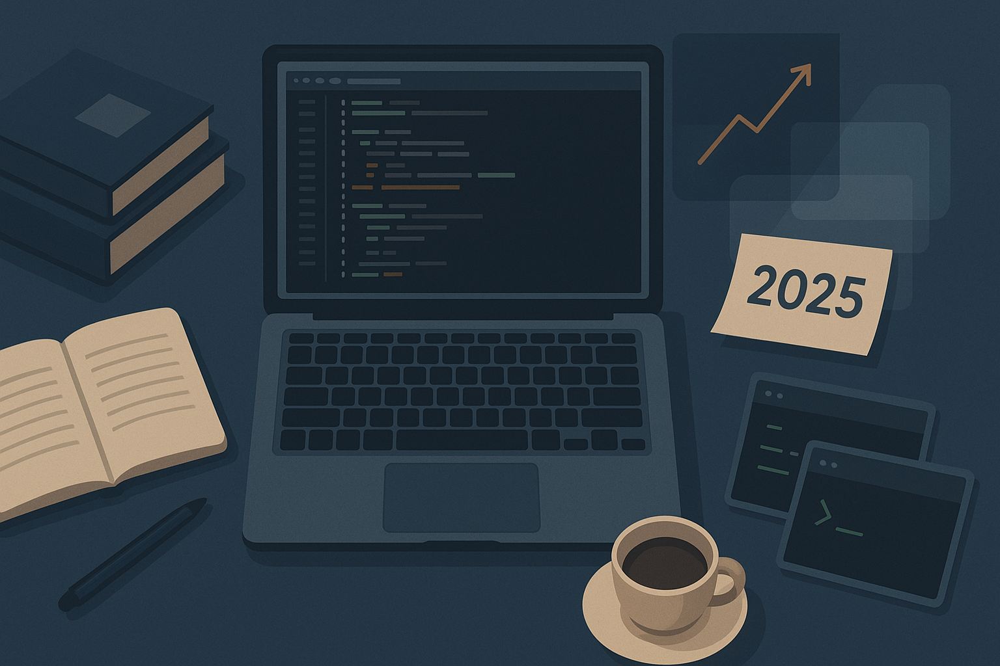

2025 was the year I stopped fighting change and started embracing it intentionally.

A lot happened this year—some of it planned, most of it a natural evolution of how I think about work, tools, and the craft of building software. Looking back at my writing and projects from these past eleven months, I see clear threads running through: an obsession with performance, a deepening relationship with AI, and an increasing clarity about what actually matters in both code and life.

Let me walk through what shaped this year.

## The Great Tooling Migration

This year was dominated by a particular kind of satisfaction: optimizing things until they sing.

In March, I finally sat down and documented my complete Vim setup—both terminal and GUI. This wasn't just configuration documentation; it was a statement about what I value: minimal, fast, and intentional. The post resonated with people because it wasn't about using the latest hyped editor. It was about understanding your tools deeply enough that they become invisible.

Then came November. After years of Packer serving me well, I migrated my entire Neovim configuration to Lazy.nvim. The numbers were stark: 1797ms startup time down to 115ms. That's a 15x improvement. But the real win wasn't just speed—it was clarity. Lazy.nvim forced me to be more deliberate about when and how plugins load. The result is a setup that's faster, more maintainable, and honestly more fun to work in.

This migration crystallized something I've been thinking about: good tooling isn't about having more features. It's about having the right features, loading at the right time, with no unnecessary overhead. That philosophy applies to everything I do now.

## The AI Inflection Point

I've been writing about AI all year, and my perspective has evolved significantly. In February, I laid out my experience with five major AI platforms: Cursor, Copilot, ChatGPT, DeepSeek, and Claude. My conclusion then was pragmatic but uncertain: these tools are powerful but inconsistent.

By May, I had articulated a workflow that still feels right. AI as a pair programmer, not a code generator. Think deeply, plan with the AI, implement carefully, review critically, and commit with your name on it. This approach acknowledges AI's genuine usefulness without surrendering agency.

Then in July, I went deeper. "AI Agents, Me, and My Feelings" was me working through something real: the anxiety that comes with powerful tools. If I let AI write most of my code, will I remember it? Will my skills atrophy? The honest answer is: yes, if you're not careful. But the solution isn't to avoid AI. It's to use it strategically.

By August, I had redefined my entire workflow. Out with VSCode-based editors. In with a multi-pane command-line approach: Vim for coding, AI tools running in a dedicated pane, LazyGit for version control. This setup feels native to how my brain works. No distractions, full modularity, room to breathe.

The throughline here is intentionality. AI isn't a magic wand. It's a tool that amplifies both your strengths and your weaknesses. Use it to automate the truly tedious work. Use it for research and exploration. Use it as a code reviewer. But the important decisions, the hard thinking, the architecture—that still needs to be you.

## Go 1.25: A Runtime Revolution

In August, I dived deep into Go 1.25, and honestly, it energized me. This wasn't a minor version bump. The container-aware GOMAXPROCS feature solves a problem that's plagued Go users in Kubernetes environments for years. The experimental Green Tea GC offers 10-40% performance improvements. The trace flight recorder opens debugging possibilities that were previously impossible.

What struck me was how the Go team continues to deliver practical improvements that solve real-world problems. Not for the sake of novelty, but because they understand their users' pain points. That's good stewardship of a language.

## Books, Focus, and the Deeper Work

In June, I shared my entire reading stack. It wasn't random—it was deliberate. Books on deep work, focus, systems thinking, distributed systems, Go, and self-mastery. The through-line is clear: I'm investing heavily in understanding how to think better, build better systems, and live more intentionally.

Cal Newport's "Deep Work" and "Digital Minimalism" kept coming up throughout the year in my writing. There's something increasingly important about the ability to focus deeply in a world of endless distraction. And I'm not talking about ignoring the world. I'm talking about choosing what deserves your attention.

## What I Learned

2024 ended with a commitment to enjoy life more and write more. 2025 delivered on both.

The writing came easier. I published substantial posts on architecture, tooling, and philosophy. Not because I had answers, but because working through the questions publicly helped clarify my own thinking.

The enjoyment part was harder. It's easy to let work dictate your mood. It's easy to obsess over optimization until you forget why you're optimizing in the first place.

But here's what shifted: I got clearer about what actually matters. It's not about having the perfect setup (though I do like good tooling). It's about using the time you have—with your family, with your work, with your learning—to build something you're proud of. And doing that consistently, without burning out.

The daily short blog posts in February were an experiment in this. Just showing up every day, writing something, nothing fancy. Some worked, some didn't. The point was the consistency and the honesty.

## What's Next

As I head into the last month of 2025, here's what's clear:

1. **Tooling is increasingly a choice, not destiny.** You can have a world-class development environment without subscribing to whatever's hyped this quarter. Be intentional.

2. **AI is real, and the early adopters who figure out how to work alongside it (not let it work for them) will be far ahead.** This isn't about replacing developers. It's about augmenting human judgment with machine capability.

3. **Deep work is rarer and more valuable than ever.** The ability to think through a complex problem, implement it well, and ship it—that skill doesn't get cheaper.

4. **Books still matter.** In a world of tweets and hot takes, a well-written book that makes you think differently is increasingly precious.

5. **Your biggest threat isn't AI.** It's good developers armed with the superpower of understanding how to use AI well.

## Conclusion

2025 was a year of refinement. Not revolutionary change, but steady, intentional improvement. Better tooling. Clearer thinking about AI. A deeper commitment to deep work. More writing. Better reading.

If 2024 was about change and transition, 2025 was about integration—taking the new circumstances and building something stable, sustainable, and genuinely good.

I'm heading into 2026 with more energy, more clarity, and fewer illusions. The tools are good. The challenges are real. The opportunities are enormous. And I'm ready.

---

*If you're interested in any of the topics I've touched on here—from Neovim optimization to practical AI workflows to Go's newest features—I'd recommend diving into those posts. They go much deeper than what fits in a year review.*

*What shaped your 2025? I'd love to hear what stuck with you.*
