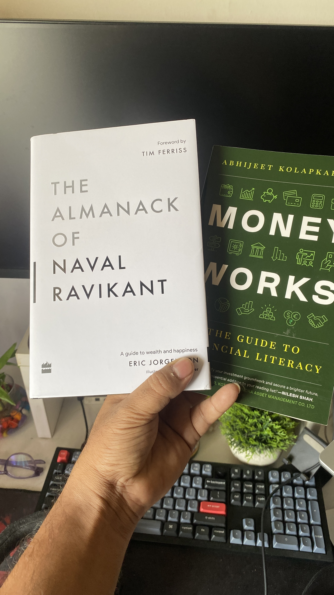

I have been in a bit of stagnancy these days. Things has not been smooth, health has been not that great either. The worse has been my mental health.
I have been unhappy and moody of late and I **really, really** don't like this version of me.

I think reading books and keeping my busy always helps. I think I have been very bad at time management and that has caused majority of my problems.
When to work and when to take a good break is an art I have have not mastered. 

But I am not a person who gives up easily. So I am working actively on myself and want to get happier, and enjoy my life and work more.

Here is a couple of my new books my son gifted me to this "Fathers Day". I love my kiddo more than anything else in this world.

