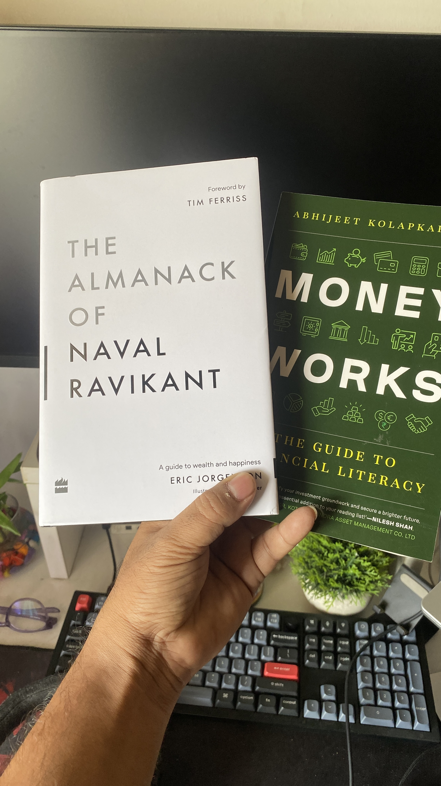

I have felt stagnant lately. Things have not been smooth, and both my physical and mental health have suffered.
I have been unhappy and moody of late and I **really, really** don't like this version of me.

Reading books and keeping my mind engaged have always helped. Poor time management has caused many of my problems.
Knowing when to work and when to take a proper break is an art I have not mastered yet.

But I am not a person who gives up easily. So I am working actively on myself and want to get happier, and enjoy my life and work more.

Here are a couple of new books my son gifted me on this "Fathers Day". I love my kiddo more than anything else in this world.

