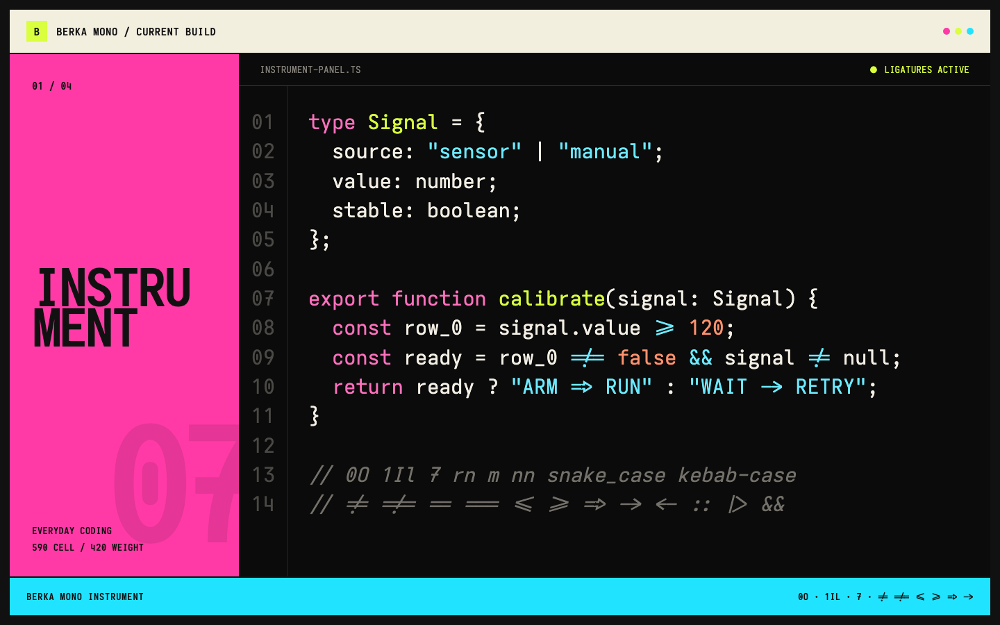
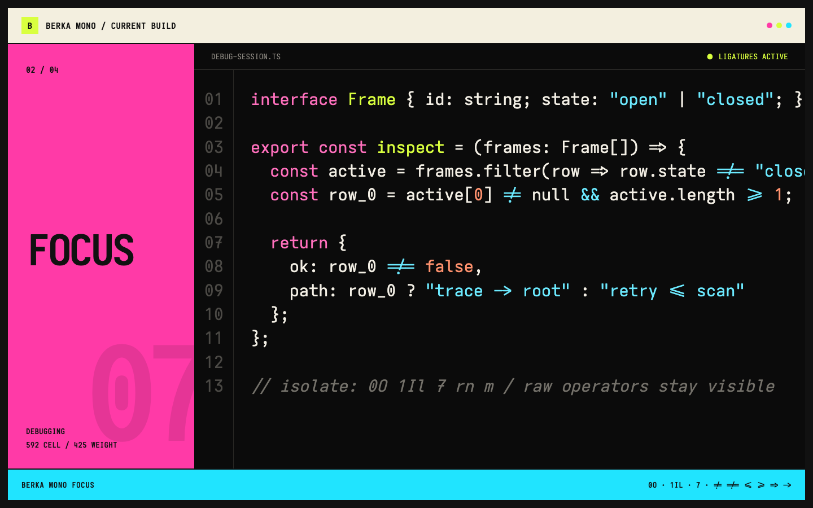
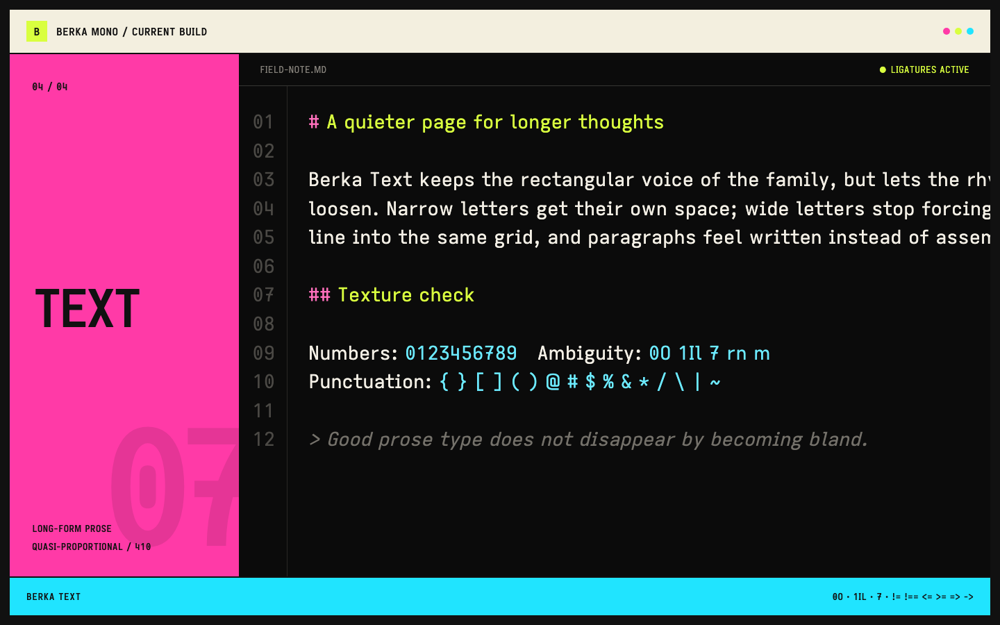

[Berka v1.1.0](https://github.com/vinitkumar/berka-mono-closer/releases/tag/v1.1.0) is out. This release makes the four Berka families easier to inspect, compare, and try before installing them.

The font binaries are unchanged from v1.0.1. The release focuses on the showcase and specimen experience.



## An interactive specimen lab

The redesigned [Berka showcase](https://vinitkumar.github.io/berka-mono-closer/) now includes an editable specimen lab. You can switch families, change weight and size, toggle ligatures, and paste in your own code.

The site also explains the role of each family without making you infer it from filenames:

- **Instrument** for everyday code and expanded ligatures
- **Focus** for debugging and restrained ligatures
- **Closer** for a wider coding rhythm
- **Text** for prose and long-form reading



## Clearer comparisons

The new layout puts ambiguous glyphs such as `0`, `O`, `1`, `I`, `l`, and `7` next to each other. A compact family matrix makes width, texture, and intended use easier to compare.

The install command is now prominent and copyable, and the page adapts cleanly to smaller screens. The release also adds dedicated social-preview and favicon artwork.

## Refreshed specimens

The repository screenshots were regenerated from the checked-in WOFF2 builds. They now show the current numerals, ambiguity set, punctuation, italics, and programming ligatures for each family.



Install the recommended Instrument family with:

```sh
curl -fsSL https://raw.githubusercontent.com/vinitkumar/berka-mono-closer/main/scripts/install.sh | sh -s -- instrument
```

Try the [live showcase](https://vinitkumar.github.io/berka-mono-closer/) or read the [v1.1.0 release notes](https://github.com/vinitkumar/berka-mono-closer/releases/tag/v1.1.0).
