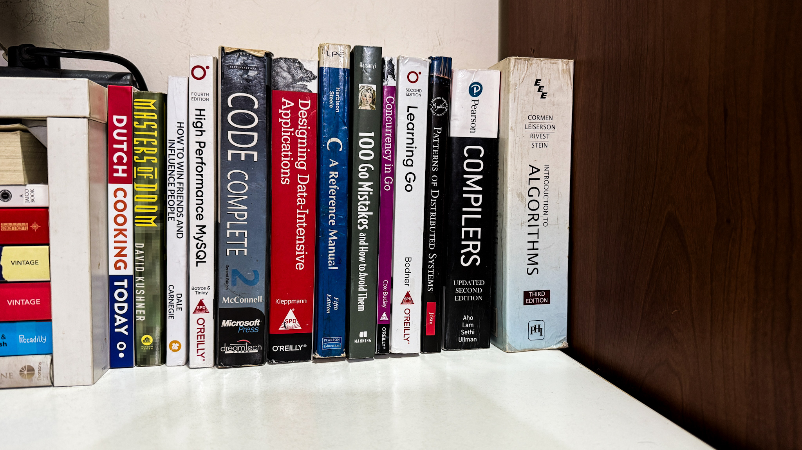

# 📚 Books on My Desk Right Now
*A themed curation for anyone who loves thinking deeply, building well, and living intentionally.*

I often rotate through books that either challenge how I think or sharpen how I work.
Here’s what’s currently in my reading stack—grouped by themes that matter to me.

---

## 🧠 Focus, Productivity & Deep Work
**Mastering attention in a distracted world.**

- **Deep Work** – *Cal Newport*
  One of the most important books I’ve read on achieving meaningful output in today’s distraction-heavy world.

- **Digital Minimalism** – *Cal Newport*
  Helps cut digital noise and reclaim intentionality in how we use tech.

- **Hyperfocus** – *Chris Bailey*
  Great blend of science and practice on when to zoom in and when to intentionally scatter your focus.

- **Do It Today** – *Darius Foroux*
  Short, punchy, and action-oriented. Good for anyone struggling with procrastination.

---

## 📈 Self-Mastery & Personal Growth
**Mental models, discipline, and growth mindset.**

- **The Almanack of Naval Ravikant** – *Eric Jorgenson*
  A goldmine of clarity on wealth, happiness, and leverage. I keep coming back to it.

- **101 Essays That Will Change The Way You Think** – *Brianna Wiest*
  Big ideas delivered in short essays. Great for reflection and reframing.

- **Mind Master** – *Viswanathan Anand*
  Chess legend shares how he stays sharp, focused, and humble. Surprisingly practical.

- **The Greatest Secret** – *Rhonda Byrne*
  For those who seek peace and grounding through inner awareness.

---

## 💸 Psychology, Communication & Money
**Relationships and behavior, where it really counts.**

- **The Psychology of Money** – *Morgan Housel*
  Simple truths that reframe how I think about money and decisions.

- **How to Win Friends and Influence People** – *Dale Carnegie*
  Still relevant, still powerful. Essential read for anyone who works with people.

- **How to Talk So Kids Will Listen…** – *Adele Faber & Elaine Mazlish*
  Despite the title, it’s a masterclass in empathetic communication—for parents and leaders alike.

---

## 🎯 Life Philosophy & Memoir
**Stories and ideas that shape perspective.**

- **Zen and the Art of Motorcycle Maintenance** – *Robert M. Pirsig*
  Slow, philosophical, and incredibly rewarding. Explores the intersection of logic, art, and living well.

- **Surely You’re Joking, Mr. Feynman!** – *Richard P. Feynman*
  Whimsical yet brilliant. Feynman’s curiosity is contagious.

- **Masters of Doom** – *David Kushner*
  A thrilling look at creativity, rebellion, and tech entrepreneurship. Highly recommended for builders.

---

## 💻 Software Engineering Mastery
**For going from good to great in engineering.**

- **Code Complete** – *Steve McConnell*
  An engineering bible. Every serious developer should read it.

- **Designing Data-Intensive Applications** – *Martin Kleppmann*
  Still one of the best books on systems architecture and backend design.

- **High Performance MySQL** – *Baron Schwartz et al.*
  Essential if you’re tuning or scaling databases.

- **Patterns of Distributed Systems** – *(various authors)*
  Understand and apply foundational patterns behind large-scale apps.

---

## ⚙️ Systems Programming & Compilers
**For those who love understanding the machine.**

- **C: A Reference Manual** – *Harbison & Steele*
  Not glamorous, but rock-solid. Deepen your C fundamentals.

- **Compilers (Dragon Book)** – *Aho, Lam, Sethi, Ullman*
  If you ever wanted to build a language or understand how they work under the hood—this is it.

- **Introduction to Algorithms (CLRS)** – *Cormen et al.*
  The classic on algorithms. Still hard. Still worth it.

---

## 🧬 Go Programming Track
**If Go is your main tool—this path sharpens it.**

- **Learning Go** – *Jon Bodner*
  Great intro with just enough depth. Good for onboarding too.

- **Concurrency in Go** – *Katherine Cox-Buday*
  Explains goroutines, channels, and concurrency models with clarity.

- **100 Go Mistakes and How to Avoid Them** – *Teiva Harsanyi*
  A goldmine of real-world issues and better practices.

---

This stack fuels both the craft of building software and the art of being thoughtful in life and work.
If you’ve read any of these—or have recommendations—I’d love to hear them!

---

#books #softwareengineering #personalgrowth #deepwork #goprogramming #readinglist #developers
