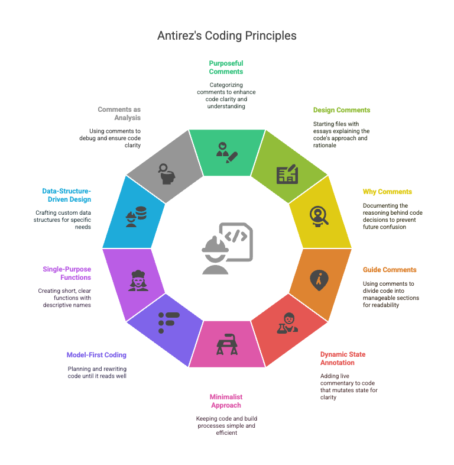

Antirez is one programmer I respect a lot. He has a singular approach and style of programming that is both effective and efficient. I have been following him and his blogs for over an decade and its amazing how much you can learn watching him work. He is recently very active on 📺 [Youtube](https://www.youtube.com/@antirez) and I would highly recommend watching him code and explain.


This tips are compiled from this blogs and his code on Github.



## 🧠 Write Code Like Salvatore Sanfilippo (antirez)

- Drawn from Salvatore Sanfilippo’s [blog post on comments](https://antirez.com/news/124) and the [Redis source code](https://github.com/redis/redis).
- Each tip includes concrete actions and examples for you to follow.


## 1. Write Comments with a Purpose Class – Not a Reflex

Sanfilippo categorizes comments into nine types:

- ✅ Function
- ✅ Design
- ✅ Why
- ✅ Teacher
- ✅ Guide
- ✅ Checklist
- ❌ Trivial
- ❌ Debt
- ❌ Backup

**✅ Action →** Before committing code, mentally label every new comment. Keep it only if it fits in the first six.


## 2. Put a Design Comment at the Top of Every Non-Trivial File

He often opens a file with a short essay on **how** the piece works and **why** the chosen algorithm won.

**✅ Action →** Start new modules with a 10–20 line *"README-inside-the-file"* explaining the approach and discarded alternatives.


## 3. Use “Why Comments” to Freeze Hidden Reasoning

Lines that seem obvious in a diff often hide performance traps or protocol quirks. He documents those explicitly.

**✅ Action →** Anytime you touch a conditional or a magic constant, ask: *“Will future-me remember why?”* If not, write a Why comment.


## 4. Lower Cognitive Load with Guide Comments and Vertical Rhythm

Redis files often have simple headers like:

```c
/* Free the query buffer */
```

These serve as section dividers to help skimming.

**✅ Action →** When a function exceeds ~40 lines, break it into visual blocks using one-line `Guide` comments.


## 5. Annotate Dynamic State *In Situ*

In Redis Lua helpers, he prints the Lua stack after every mutation—so readers never reconstruct it mentally.

**✅ Action →** For code that mutates state (stack, buffer, etc.), add live commentary after each transformation.

## 6. Keep the File/Build Surface Tiny

[Kilo](https://github.com/antirez/kilo), his text editor, is <1000 LOC. Redis builds with one `make`. He avoids unnecessary complexity.

**✅ Action →**
- Favor plain C/C++ (or Go/Rust) and the standard library unless a third-party dependency buys *a lot*.
- Resist new build steps. If one is needed, explain it in the Design comment.

## 7. Model First, Code Later – “Code is Rewriting”

He compares coding to rewriting paragraphs in a novel—iterate until it reads well.

**✅ Action →** For greenfield components, plan to rewrite the first version at least once before merging.

## 8. Short, Single-Purpose Functions with CamelCase Names

Redis helpers like `raxSeekGreatest` or `clientHasPendingReplies` are clear, action-oriented, and do one thing.

**✅ Action →**
- Keep functions <100 LOC; if it grows, split it.
- Use `UpperCamelCase` for functions and `lowerCamelCase` for variables.

## 9. Prefer Data-Structure-Driven Design

He crafts his own arrays ([SDS](https://github.com/redis/redis/blob/unstable/src/sds.c)), radix trees ([Rax](https://github.com/antirez/rax)), and vectors instead of using generic containers.

**✅ Action →**
- Sketch your data structure on paper.
- If generic containers hide too much logic or performance, implement a slim, focused version and document it.

## 10. Use Comments as an Analysis Tool

He sees comments as a tool for **rubber-duck debugging**—if you can’t explain it clearly, it’s not ready.

**✅ Action →** Don’t commit until you can explain every non-trivial function in 2–3 sentences that feel *obviously true*.

## 🛠️ Putting It into Practice

1. **Start** each file with a **Design comment**.
2. **Code** small, single-purpose functions; separate logic using **Guide comments**.
3. **Review** all comments: label them, trim the unnecessary ones, add Why or Teacher comments as needed.
4. **Refactor** if a comment feels like an apology or excuse—make the code speak for itself.
5. **Commit** with a message that reflects what changed and *why*, ideally mirroring your Why comments.

> Follow this loop and your codebase will begin to read like Redis:
> **direct**, **self-narrating**, and friendly to the next engineer—quite possibly *future-you*.

### 📚 Further Reading & Resources

- 📝 [Salvatore’s blog post on comments](https://antirez.com/news/124)
- 🧠 [Redis source code (GitHub)](https://github.com/redis/redis)
- ✏️ [Rax: A radix tree implementation](https://github.com/antirez/rax)
- 📃 [SDS (Simple Dynamic Strings) in Redis](https://github.com/redis/redis/blob/unstable/src/sds.c)
- 💡 [Kilo — 1K LOC text editor](https://github.com/antirez/kilo)
- 📺 [Youtube Channel](https://www.youtube.com/@antirez)
