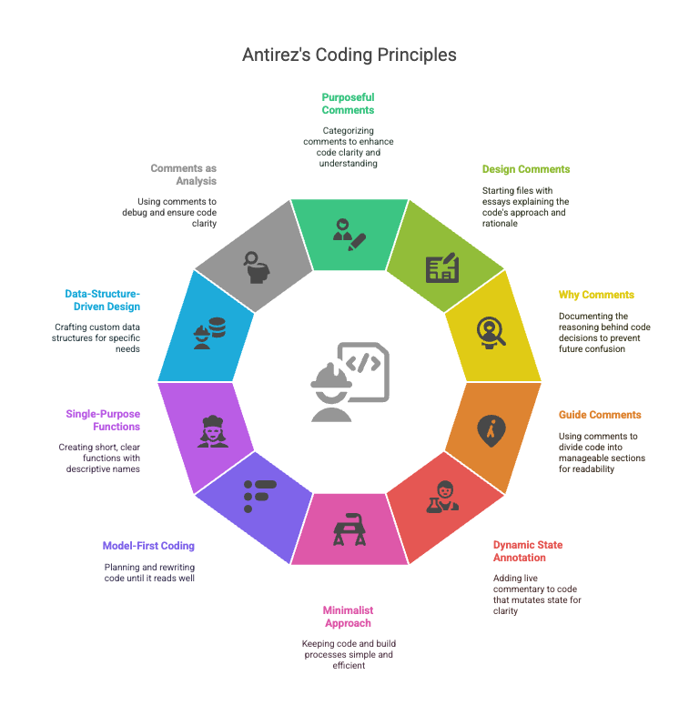

Salvatore Sanfilippo, better known as antirez, writes code with unusual clarity. I have followed his work for more than a decade, from Redis and its supporting data structures to smaller projects such as the Kilo editor. His code rewards reading because the implementation and the explanation reinforce each other.

He also publishes thoughtful essays and coding sessions on [YouTube](https://www.youtube.com/@antirez). The lessons below draw primarily from his essay [“Writing system software: code comments”](https://antirez.com/news/124) and from reading the [Redis source](https://github.com/redis/redis).

## 1. Give every comment a job

Sanfilippo describes nine kinds of comments: function, design, why, teacher, guide, checklist, trivial, debt, and backup. The first six help readers; the final three often reveal clutter or unfinished code.

Before keeping a comment, ask what job it performs. If it merely repeats the next line, remove it. If it preserves reasoning that the code cannot express, make it precise.

## 2. Explain the design where readers need it

A nontrivial file often benefits from a short design comment near the top. Explain how the component works, which constraints shaped it, and why this approach won over plausible alternatives.

The goal is not a fixed line count or a miniature specification. It is to give readers the model they need before they encounter the details.

## 3. Preserve hidden reasoning

A conditional, ordering constraint, or constant may look arbitrary even when it protects a protocol rule or performance property. A good “why” comment records that invisible constraint.

Write the comment when a future maintainer could simplify apparently awkward code and accidentally reintroduce the bug it prevents.

## 4. Use guide comments as signposts

Long functions sometimes contain several coherent phases that do not deserve separate functions. Short guide comments can mark those phases and make the control flow easier to scan.

Use them to reveal structure, not to narrate every statement.

## 5. Show state that is hard to reconstruct

Code involving stacks, parsers, buffers, or compact encodings can force readers to simulate several transformations in their heads. A compact annotation showing the state after each important change reduces that burden.

The best comment saves the reader from doing error-prone mental execution.

## 6. Keep the build and dependency surface small

[Kilo](https://github.com/antirez/kilo) demonstrates how much a compact codebase can teach. Redis likewise keeps a straightforward build despite its sophistication.

A small surface is not a rule against dependencies. It is a demand that every dependency and build step earn its cost in capability, maintenance, and understanding.

## 7. Treat code as rewriting

Clear code rarely arrives in its final form. The first implementation teaches you the shape of the problem; the next pass lets you express that shape more directly.

Budget time to rename, reorder, remove, and simplify after the behavior works.

## 8. Make functions tell the story

Names such as `raxSeekGreatest` and `clientHasPendingReplies` communicate an action and a subject. Small, focused functions then let those names form a readable sequence.

Do not chase an arbitrary line limit. Split a function when doing so creates a meaningful abstraction or makes its control flow easier to understand.

## 9. Let data structures shape the design

Projects such as [SDS](https://github.com/redis/redis/blob/unstable/src/sds.c) and [Rax](https://github.com/antirez/rax) show the leverage of choosing—or building—the right representation.

Before adding layers of control flow, sketch the data and its operations. A representation that matches the problem can remove whole categories of special cases.

## 10. Use explanation as a test

Writing a design or “why” comment forces you to state what you believe the code does. If the explanation becomes vague, defensive, or surprisingly long, the design may still need work.

Comments are therefore not only documentation. They are an instrument for thinking.

## A practical review loop

When reviewing a module:

1. Write down its purpose and governing constraints.
2. Read each function as part of the module's story.
3. Remove comments that translate syntax into English.
4. Add context where the reasoning would otherwise disappear.
5. Simplify code that needs an apology instead of an explanation.

The larger lesson is not to imitate the surface style of Redis. It is to respect the reader. Good code exposes its structure, good comments preserve its reasoning, and good design reduces how much of either we need.

## Further reading

- [Writing system software: code comments](https://antirez.com/news/124)
- [Redis source code](https://github.com/redis/redis)
- [Rax: a radix tree implementation](https://github.com/antirez/rax)
- [SDS: Simple Dynamic Strings](https://github.com/redis/redis/blob/unstable/src/sds.c)
- [Kilo: a small text editor](https://github.com/antirez/kilo)
- [Antirez on YouTube](https://www.youtube.com/@antirez)
