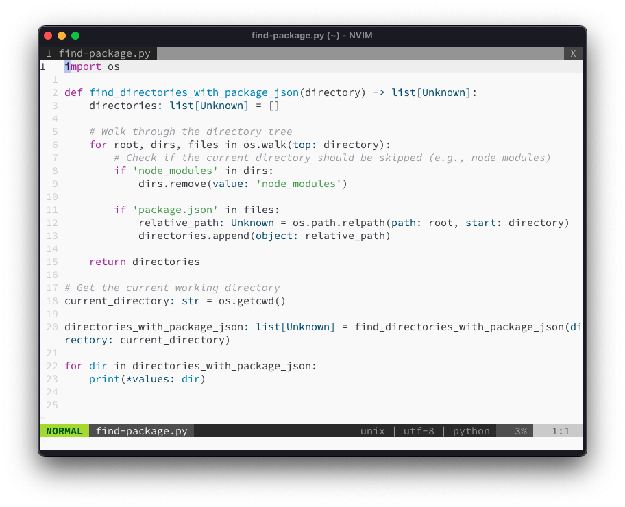
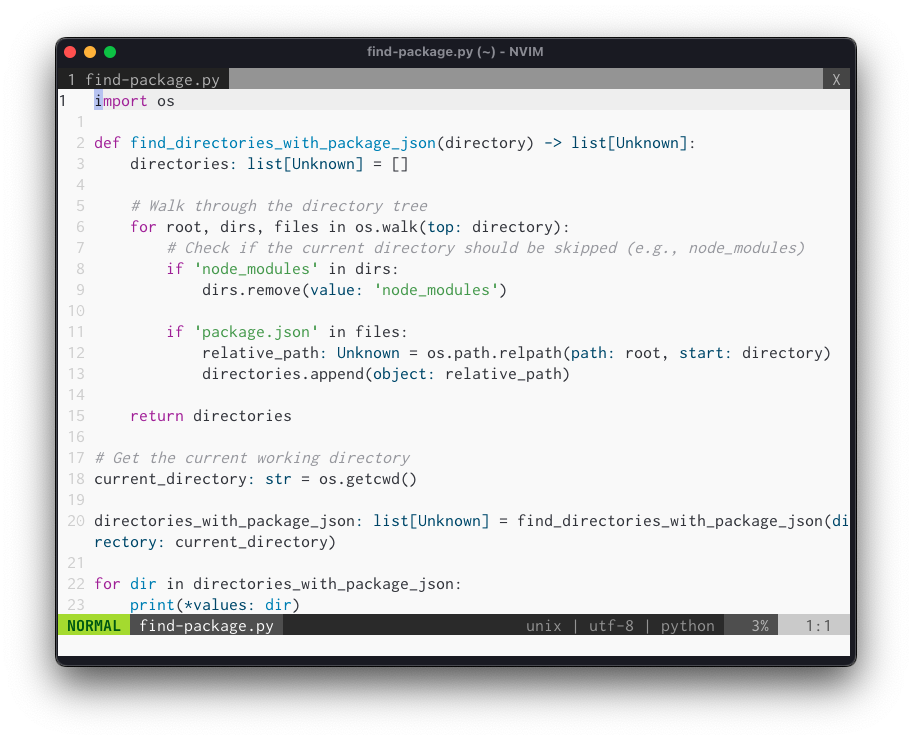
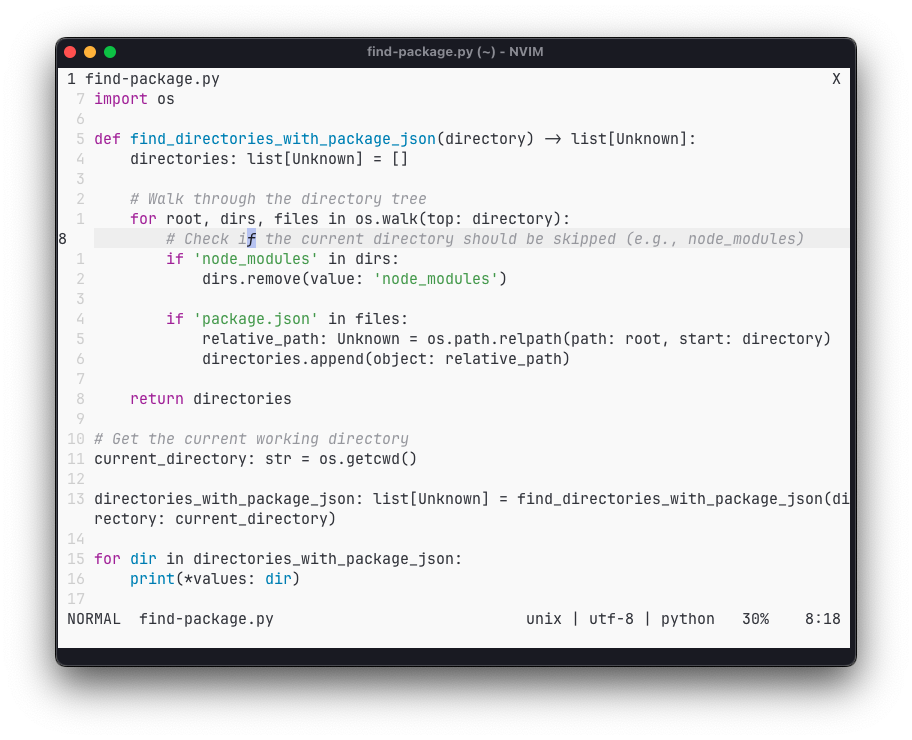
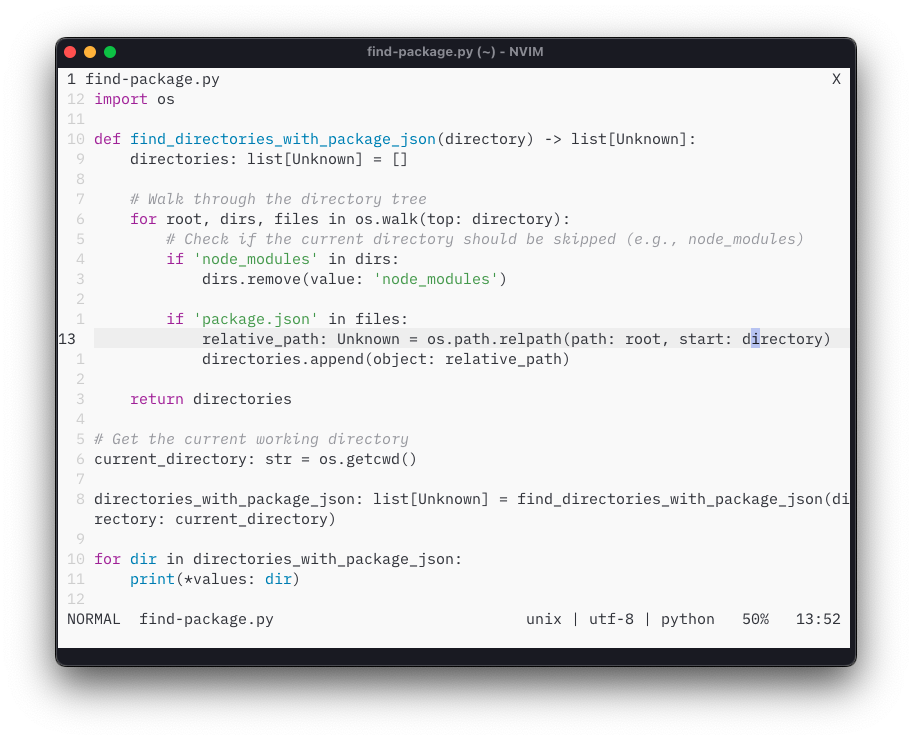
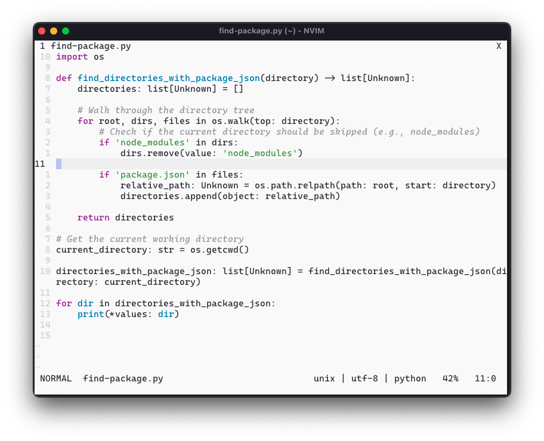
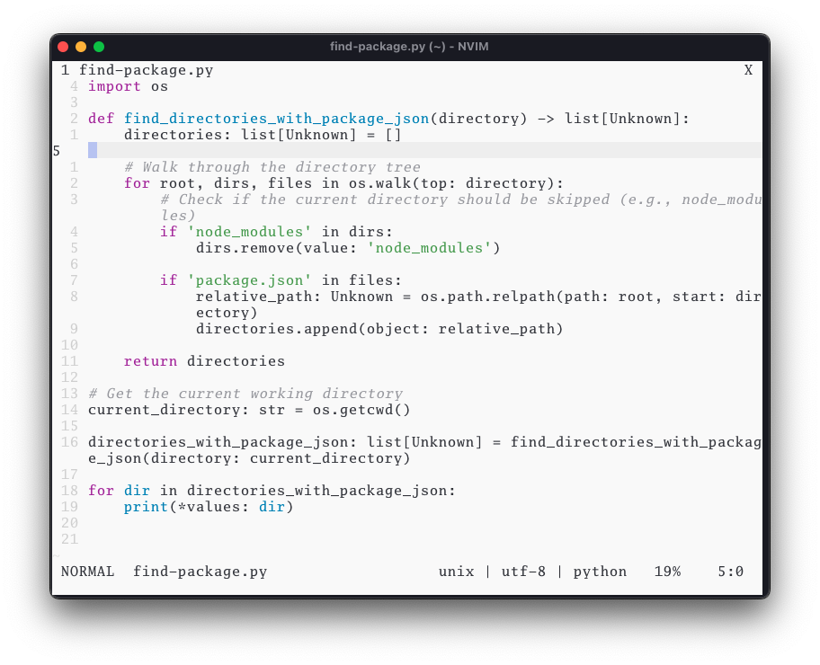
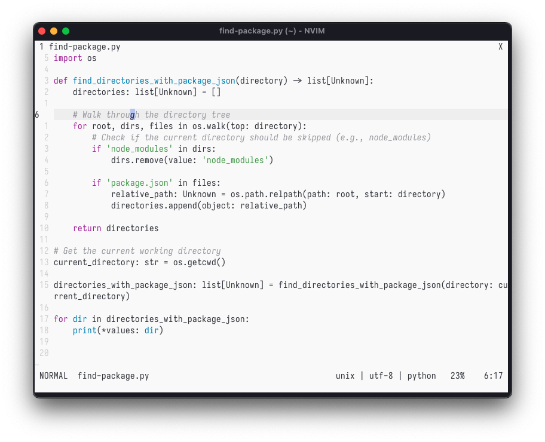
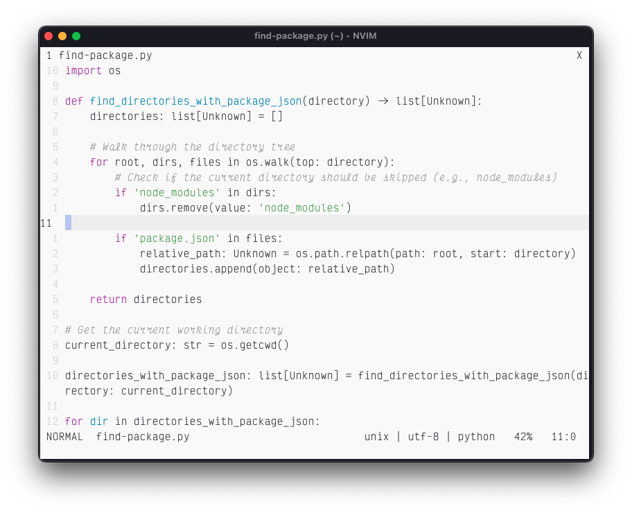
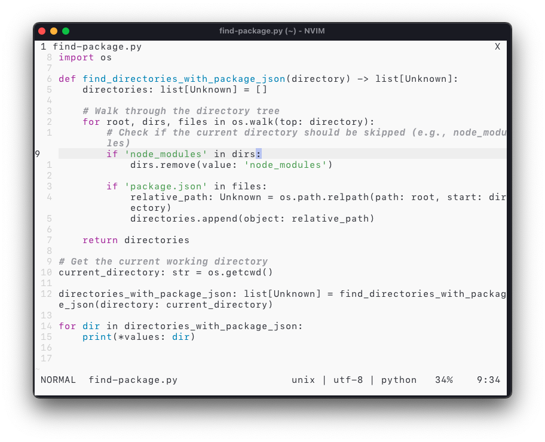

I think every programmer who loves their craft must love one font or another and I am no exception. I have always been fascinated by the beauty of fonts and the way they can make or break a design. I have always been a fan of monospaced fonts and I have tried a lot of them over the years.

Here are some of my favorite monospaced fonts that I have used over the years:

I tried to make screenshots of these fonts in my terminal (Ghostty), with vim and rendering the same piece of code.

- Source Code Pro

    It is pretty much my all time favorite font. I always keep coming back to it and many programmers who I respect also use it even to date. It is a very readable font and it looks great on any screen.

- Inconsolata (G)

  I love this font. It is simple, not frills and reads great on any screen. It is one of a classic monospaced font that I have used over the years.

- JetBrains Mono

  Relatively new font and I didn't liked it in the beginning, but have learned to love it over time. It is a very readable font and looks great on any screen.

- IBM Plex Mono

  It is my current favorite font. It is very nicely designed and I would recommend it to anyone looking for a new great font.

- Cascadia Code

  A good font from Microsoft. It is a very readable font and looks great on any screen but I don't use it much.

- Go mono

  I love this font as well. Simple yet, very nice font to keep you in the zone.

- Iosevka

  Relatively new font, but great. In the same league as IBM Plex Mono and JetBrains Mono. I would recommend it to anyone looking for a new great font. It's relatively thin font though so might not be everyone's cup of tea.

- Victor Mono

  I used this font for some months too. It's good and I might revisit it in future.

- SF Mono

  Apple's font. It is a very readable font and looks great on any screen. Some people love it, some don't. I am in the former camp.

