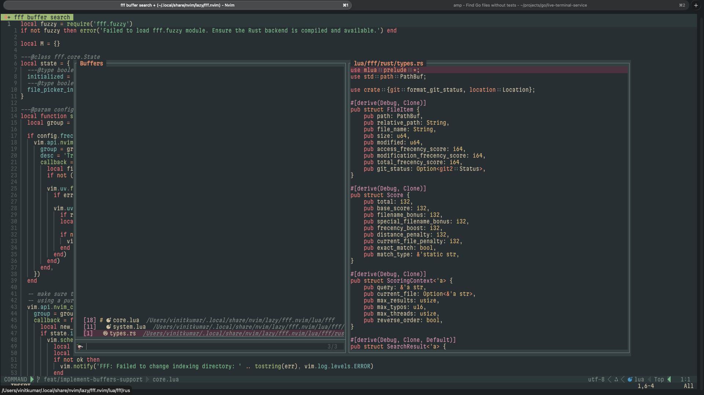

I've been a long-time [fzf.vim](https://github.com/junegunn/fzf.vim) user. `:Files`, `:Buffers`, `:GFiles?`, `:Colors`, these commands are burned into my muscle memory after years of daily use. So when I started using [fff.nvim](https://github.com/dmtrKovalenko/fff.nvim) by Dmitry Kovalenko and saw how ridiculously fast its Rust-powered file indexing was, I was immediately hooked. But there was a problem: it only did file finding and live grep. No buffer picker. No git status view. No colorscheme browser.

So I did what any self-respecting Neovim user would do. I built the missing pieces and [opened a PR upstream](https://github.com/dmtrKovalenko/fff.nvim/pull/180).



## The Upstream Story

I submitted the buffer picker as a PR to the original repo in November 2025, along with the colors and git files pickers later. The PR sat for about six weeks with no response from the maintainer. No objections, no code review requests, just silence. I get it, maintainers are busy people with their own priorities and vision for their projects. Not every contribution fits the direction someone wants to take their plugin.

So in January 2026, I closed the PR and decided to maintain my own fork. No hard feelings. That's how open source works sometimes. You contribute, and if it doesn't fit, you maintain it yourself.

## The Fork: [vinitkumar/fff.nvim](https://github.com/vinitkumar/fff.nvim)

The upstream fff.nvim is excellent at what it does. A Rust backend that indexes files faster than anything I've tested, frecency-based scoring, image previews, flex layout. Seriously impressive engineering. I didn't want to mess with any of that. What I wanted was to fill the gaps that made me keep fzf.vim around as a fallback.

My fork adds three new pickers, each modeled after the fzf.vim commands I couldn't live without:

- **`:FFFBuffers`** for buffer switching
- **`:GFiles`** for git status file picking
- **`:Colors`** for colorscheme browsing with live preview

All three are pure Lua modules that plug into fff's existing preview engine, icon system, and git utilities. No new Rust code, no external dependencies. They just work.

## Buffer Picker: `:FFFBuffers`

This was the big one. I switch between buffers constantly, and having a fuzzy picker for it is non-negotiable. Here's what the buffer picker does:

- **MRU sorting**: Buffers are sorted by most recently used, not by buffer number. It tracks access timestamps via autocmds using `vim.uv.hrtime()`, so the buffer you were just in is always at the top.
- **Status indicators**: You get `%` for current buffer, `#` for alternate, `[+]` for modified, `[RO]` for read-only. All the information at a glance.
- **File icons**: Uses `nvim-web-devicons` through fff's existing icon module.
- **Live preview**: As you navigate the list, the preview pane shows file contents. Same preview engine the file picker uses.
- **Inline buffer deletion**: Hit `<C-d>` to delete a buffer without leaving the picker. It guards against deleting modified buffers or the last remaining buffer.
- **Split and tab support**: `<C-s>` for horizontal split, `<C-v>` for vertical, `<C-t>` for a new tab.
- **Cursor restoration**: When you switch to a buffer, it jumps to the last cursor position. Small detail, but it matters.

```lua
-- Quick setup
vim.keymap.set('n', '<C-b>', function() require('fff').buffers() end)
```

## Git Files Picker: `:GFiles`

If you've ever used `:GFiles?` in fzf.vim, you know how useful it is to see only the files that have changed. My implementation does the same thing:

- Runs `git status -s` and parses the two-character status codes (staged, modified, deleted, renamed, untracked).
- Handles renames correctly, extracting the new filename from `R  old -> new` format.
- Color-coded status indicators in the sign column using fff's existing `git_utils` highlight groups.
- Full live preview on the right side.
- Guards against running in non-git directories with a clean warning.

```lua
vim.keymap.set('n', '<leader>gs', function() require('fff').git_files() end)
```

This one has become part of my daily workflow. Before committing, I hit `<leader>gs`, scan through the changed files, preview the diffs, and know exactly what I'm about to commit.

## Colors Picker: `:Colors`

This might seem like a small feature, but it's one of those quality-of-life things that makes a difference when you're tweaking your setup:

- Discovers all colorschemes from your `runtimepath` and `packpath` (both `opt` and `start` packages, `.vim` and `.lua` files).
- **Live preview**: as you move through the list, it instantly applies each colorscheme to your entire editor. You see the effect in real-time, not in some tiny preview window.
- Your current colorscheme is pinned to the top with a `*` indicator.
- Press `<Esc>` and your original colorscheme is restored. No accidental theme changes.
- The window auto-sizes to fit the longest colorscheme name.

```lua
vim.keymap.set('n', '<leader>co', function() require('fff').colors() end)
```

I built this one because I maintain [oscura-vim](https://github.com/vinitkumar/oscura-vim) and I'm constantly switching between variants to test things. Having instant live preview without leaving my editor is a huge time saver.

## What I Didn't Touch

Everything that makes fff.nvim fast remains untouched. The Rust backend, the file indexing engine, live grep, frecency scoring, query parsing, multi-select with quickfix, flex layout, path shortening, image previews. All of that comes from upstream, and I regularly merge from `upstream/main` to stay current.

My three pickers are self-contained Lua modules that reuse the existing infrastructure:

```
require('fff')
  ├── find_files()     → upstream (Rust backend)
  ├── live_grep()      → upstream (Rust backend)
  ├── buffers()        → fork (buffers.lua)
  ├── colors()         → fork (colors.lua)
  └── git_files()      → fork (git_files.lua)
```

## Why Not Just Use Telescope?

Fair question. Telescope is great, and I used it for years. But fff.nvim's Rust backend makes file finding noticeably faster on large codebases. The difference is real, especially when you're working in monorepos with tens of thousands of files. My fork just brings it closer to feature parity with the picker ecosystem I need.

## Try It Out

If you're already using fff.nvim and miss `:Buffers` or `:GFiles`, or if you're looking for a faster alternative to Telescope that doesn't sacrifice the picker variety:

```lua
-- lazy.nvim
{
  'vinitkumar/fff.nvim',
  build = 'cargo build --release',
  config = function()
    require('fff').setup({})
    vim.keymap.set('n', '<C-p>', function() require('fff').find_files() end)
    vim.keymap.set('n', '<C-b>', function() require('fff').buffers() end)
    vim.keymap.set('n', '<leader>gs', function() require('fff').git_files() end)
    vim.keymap.set('n', '<leader>co', function() require('fff').colors() end)
    vim.keymap.set('n', '<leader>rg', function() require('fff').live_grep() end)
  end,
}
```

The fork is at [github.com/vinitkumar/fff.nvim](https://github.com/vinitkumar/fff.nvim). I keep it synced with upstream, so you get all the performance improvements from Dmitry's work plus the extra pickers. Give it a spin and let me know what you think.

Cheers! 🤘
