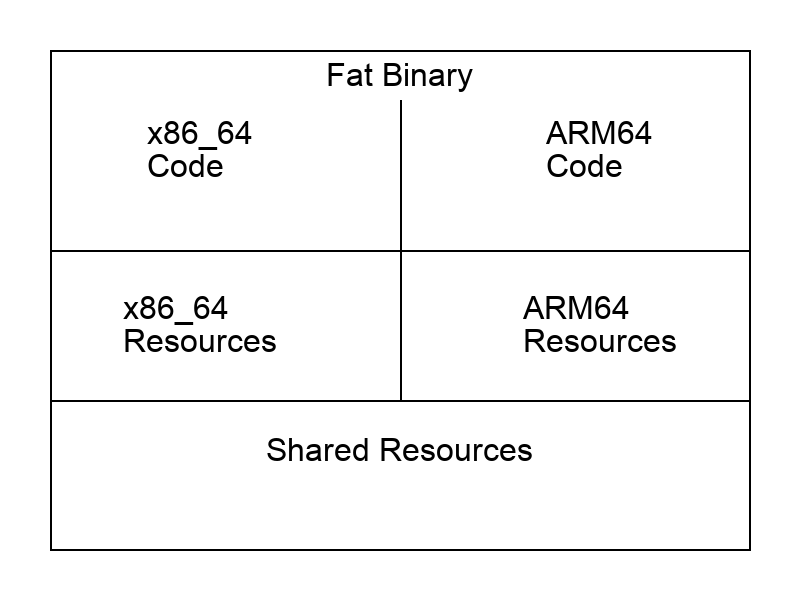

So at work, we needed to ship a binary for Mac. With Go, it is super
easy to build a binary for any OS and Architecture. However, having separate
binaries would mean additional logic to detect the target and then deliver them.
Wouldn't it be nice to ship just one binary which work on all Macs (Intel and Apple Silicon based)
We call this a Fat Binary.



Here is how you can do it:

Consider this short Go program:

Save this as main.go

```go
package main

import "fmt"

func main() {
    fmt.Println("Fat Binary")
}
```


Now, you can build a binary for both the architecture like this:

`GOOS=darwin GOARCH=arm64 go build -o mac_arm64 main.go`
`GOOS=darwin GOARCH=amd64 go build -o mac_amd64 main.go`

When you run this, you will see two binaries your folder:


```
ls
-rwxr-xr-x@ 1 vinitkumar  staff   2.1M Dec 18 18:00 mac_amd64
-rwxr-xr-x@ 1 vinitkumar  staff   2.1M Dec 18 18:00 mac_arm64
```

Alright, this looks decent, now how do we stitch them together to make a big fat binary that works
on all Macs?

Enter [Lipo](https://developer.apple.com/documentation/apple-silicon/building-a-universal-macos-binary). This utility can take two binaries and then spit out a far binary that works on all CPU architectures. On Mac, with command line tools installed it just available as `lipo`

So doing `which lipo` gives `/usr/bin/lipo`. On Ubuntu however, it comes bundles with llvm.
So you need to do this:


```
sudo apt install llvm
# and then it is present as `llvm-lipo-14` depending on which llvm it is, for me it is llvm-14
So `/usr/bin/llvm-lipo-14'
```

Now, as we have located Lipo, now, we will use it to generate the fat binary.


```
# on Ubuntu
llvm-lipo-14 -create -output "mac_universal" "mac_arm64" "mac_amd64"
# on Mac
lipo -create -output "mac_universal" "main_arm64" "main_amd64"
```

Once created, we can verify if the binary is proper using the file util.

```
file mac_universal
mac_universal: Mach-O universal binary with 2 architectures: [x86_64:Mach-O 64-bit executable x86_64] [arm64]
mac_universal (for architecture x86_64):        Mach-O 64-bit executable x86_64
mac_universal (for architecture arm64): Mach-O 64-bit executable arm64
```

You can execute this on either of the CPUs and it would just work.

## Bonus code

Here is code to generate the Ascii diagram above. You need to have Pillow installed though.


```python
from PIL import Image, ImageDraw, ImageFont
import os

# Create a new image with white background
width = 800
height = 600
image = Image.new('RGB', (width, height), 'white')
draw = ImageDraw.Draw(image)

# Try to load a font (you may need to adjust the path)
try:
    font = ImageFont.truetype("Arial.ttf", 32)
except:
    font = ImageFont.load_default()

# Draw the outer rectangle
draw.rectangle([(50, 50), (width-50, height-50)], outline='black', width=2)

# Draw the vertical divider
draw.line([(width/2, 100), (width/2, 400)], fill='black', width=2)

# Draw the horizontal dividers
draw.line([(50, 250), (width-50, 250)], fill='black', width=2)
draw.line([(50, 400), (width-50, 400)], fill='black', width=2)

# Add text
draw.text((width/4, 150), "x86_64\nCode", font=font, fill='black', anchor="mm")
draw.text((3*width/4, 150), "ARM64\nCode", font=font, fill='black', anchor="mm")
draw.text((width/4, 325), "x86_64\nResources", font=font, fill='black', anchor="mm")
draw.text((3*width/4, 325), "ARM64\nResources", font=font, fill='black', anchor="mm")
draw.text((width/2, 450), "Shared Resources", font=font, fill='black', anchor="mm")
draw.text((width/2, 75), "Fat Binary", font=font, fill='black', anchor="mm")

# Save the image
image.save('fat_binary_diagram.png')

```
