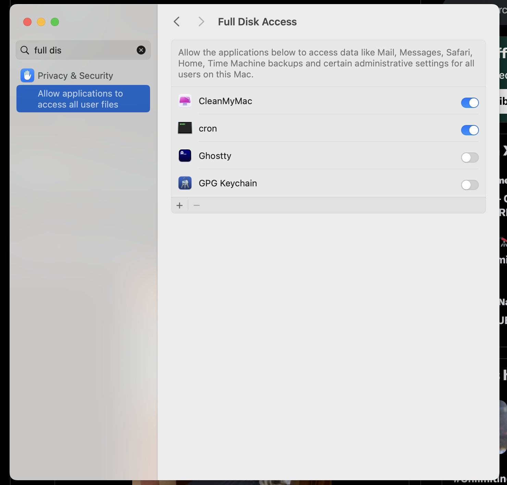

I love making notes in Obsidian. It's truly a Local-First Application. I love that it is free and doesn't keep your content hostage. However, I many multiple Macs and keeping them in sync was becoming an issue. I didn't wanted to use DropBox or Google Drive and thought why not just automated it myself with some line of code.


We only need few tools to implement:
- crontab
- shell script
- a private github repo (any git repo where you can push works)


Create an empty private repo on Github and copy the SSH URl.
Not initialize the local repo with git if it's not already done.


```sh
git init
git remote add origin git@github.com:<username>/repo.git
```


Create a new file called as `auto_commit_push.sh` in your home directory.

The idea is to execute this script in frequent intervals using crontab.

This is how the script looks like:

```sh

# Set repository path - replace with your actual path
#REPO_PATH="/Users/vinitkumar/Documents/knowledge-base"
# add path to your own repo
REPO_PATH=""


cd "$REPO_PATH" || exit

git pull origin HEAD
git push origin HEAD
git add .
git commit -m "Auto commit and push on $(date '+%Y-%m-%d %H:%M:%S')"
git push origin HEAD
```

Here is how the crontab looks like, add it by executing this:

`crontab -e`


```sh
*/1 * * * * /bin/bash ~/auto_commit_push.sh >> ~/auto_commit_push.log 2>&1
```
**IMPORTANT:** None of this will work, if you don't give full disk access to cron.


For this go to settings on Mac, and give full disk access by opening the settings, and add press `cmd + shift + g` and use `/usr/sbin` and then add `cron` to the full disk access.

Once done, you can also do the same in the other Mac and enjoy a free sync that just works, in secure.



Also, you might want to disable signing commits like this.

Go to the notes directory and disable signing commits just for this repo.


```
[commit]
	gpgsign = false
```
~~Also, add `.obsidian` to `.gitignore` so that you don't get merge conflicts between multiple machines.
All we care about notes files, and not the Obsidian configurations.~~

Actually, we should sync the whole folder because we want the plugin and settings sync as well which is stored in .obsidian folder.

```
.obsidian/*
```

However, if you can afford, I would suggest to buy a paid obsidian subscription for [sync](https://obsidian.md/sync) as it is a genuinely great software.
