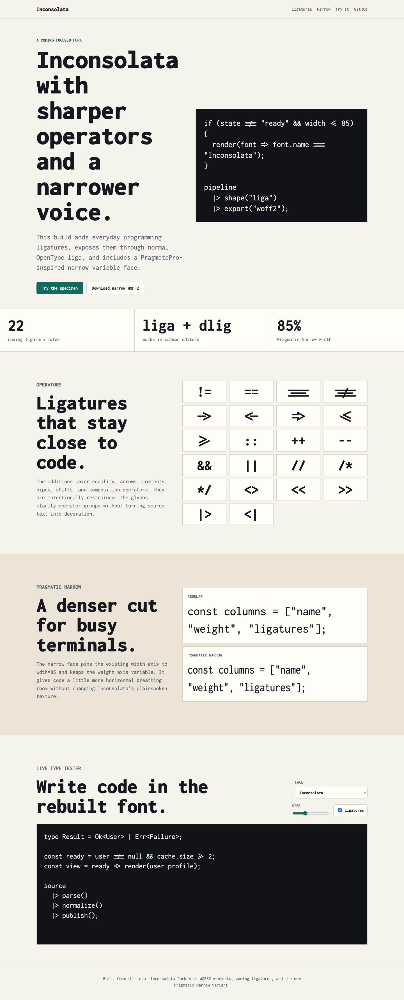
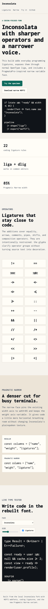

I spent some time polishing my [Inconsolata fork](https://github.com/vinitkumar/Inconsolata) into something I would actually want to use every day: coding ligatures, a slightly narrower variant, rebuilt font artifacts, and a small live specimen site.

The demo is live here:

[https://vinitkumar.github.io/Inconsolata/](https://vinitkumar.github.io/Inconsolata/)

## What changed

The first pass added ligature glyphs, but I realized quickly that having them only under `dlig` was not enough. Most editors do not enable discretionary ligatures by default. So the rebuilt font now exposes the operator substitutions through both `liga` and `dlig`.

The ligature set covers the operators I reach for most often:

```sh
!= == === !== -> <- => <= >= :: ++ -- && || // /* */ <> << >> |> <|
```

I also added **Inconsolata Pragmatic Narrow**, a narrower variable build inspired by the density of PragmataPro. It pins the existing width axis to `wdth=85` while preserving the weight axis, so it feels familiar but gives code a little more horizontal room.

## The demo site

The site uses WOFF2 files from the rebuilt font output and includes:

- a ligature specimen grid
- a regular vs narrow comparison
- a live type tester with ligature toggle
- a direct download link for the narrow WOFF2



## Build notes

The full rebuild produced static TTF, OTF, WOFF2 webfonts, the variable font, and the new Pragmatic Narrow WOFF2/TTF pair. I also verified the generated font binaries for the expected glyphs and OpenType substitutions.

There is no italic or bold italic build in this fork yet. The source has upright masters, so the current family gives me regular, bold, other upright weights and widths, and the new narrow variable variant.

This was a small but satisfying kind of tool work: not a new project, just one of the surfaces I stare at all day becoming a little more mine.
