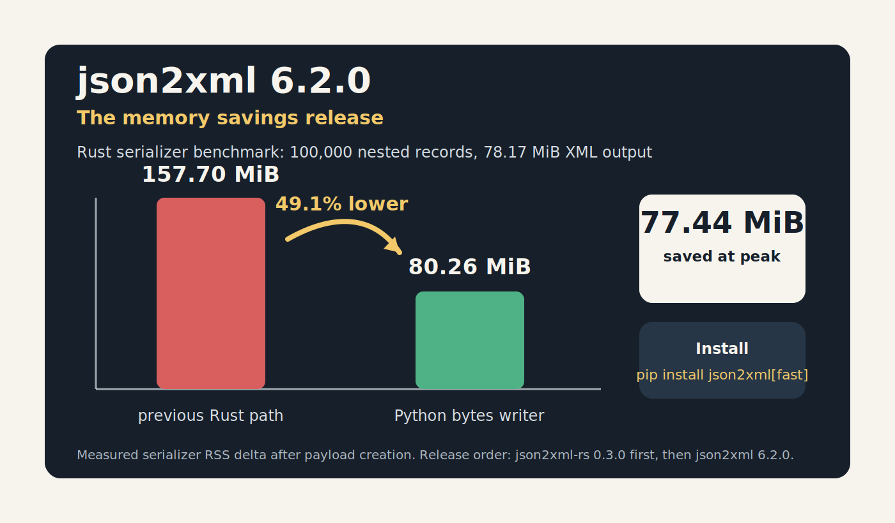

I released [json2xml 6.2.0](https://github.com/vinitkumar/json2xml/releases/tag/v6.2.0) today, along with [json2xml-rs 0.3.0](https://pypi.org/project/json2xml-rs/0.3.0/). This is not a flashy API release. It is a release about making the common path use less memory.

The short version: the Rust serializer's measured peak RSS delta dropped from **157.70 MiB** to **80.26 MiB** on a 100,000-record benchmark. That is **77.44 MiB saved**, or about **49.1% lower peak serializer memory**.

For users, the upgrade is simple:

```bash
pip install --upgrade json2xml
pip install --upgrade "json2xml[fast]"
```

The `fast` extra now requires `json2xml-rs>=0.3.0`, so users get the memory-saving Rust wheel when they install the accelerated path.

## Why memory became the next target

Earlier this year I added a native Rust extension to json2xml. That work was mostly about speed. The Rust path made normal conversions much faster while keeping the Python API intact.

But performance is not only latency. For large JSON payloads, peak memory can be the real limit. A serializer can be fast and still be wasteful if it holds multiple copies of the same output in memory.

That was the issue here. The old Rust implementation built the XML in a Rust string and then crossed the Python extension boundary by creating Python bytes. For a small response, nobody cares. For a large response, that temporary string matters.

## What changed in Rust

The new Rust path writes directly into Python's bytes writer instead of first materializing a large Rust string for the extension boundary.

Conceptually, the old path looked like this:

```text
Python data -> Rust XML string -> Python bytes
```

The new path is closer to this:

```text
Python data -> Python bytes writer
```

The serializer still walks the Python objects from Rust. It still produces the same UTF-8 XML bytes. The important difference is that the final output buffer is the thing being written, not a second large intermediate object that needs to exist before the returned bytes can be created.

## What changed in Python

The pure Python serializer also got a smaller memory improvement in the rooted-output path.

The older code assembled the body and root wrapper through an intermediate output list. The new path builds the rooted document in a way that releases the unwrapped XML body before final UTF-8 encoding. That keeps peak memory closer to the returned byte size without changing the public API.

I also removed an unnecessary decode step before pretty-print parsing. Since the serializers already return UTF-8 bytes, pretty printing can parse those bytes directly instead of briefly creating another string copy.

## The benchmark

I added a reproducible benchmark script and documentation in the json2xml repo:

- `benchmark_memory_rust.py`
- `docs/rust_memory_benchmark.rst`

The benchmark generates 100,000 nested records and measures process RSS after payload creation versus peak RSS after calling:

```python
json2xml_rs.dicttoxml(payload, attr_type=True)
```

The payload is intentionally large enough to make output memory visible:

| Metric | Value |
| --- | ---: |
| Generated records | 100,000 |
| Input JSON equivalent | 44.31 MiB |
| XML output | 78.17 MiB |
| Previous Rust serializer RSS delta | 157.70 MiB |
| New Rust serializer RSS delta | 80.26 MiB |
| Savings | 77.44 MiB |
| Reduction | 49.1% |

There is a tradeoff. In this benchmark, release-build conversion time moved from 0.180s to 0.265s. I am comfortable with that tradeoff for this release because the goal was reducing peak memory for large outputs, and the Rust path remains fast for practical use.

## Fixing the release details

This release also tightened the Rust build setup.

The crate now targets Rust 2024 and pins:

```toml
rust-version = "1.96"
```

That exposed a useful CI issue: GitHub-hosted runners were still defaulting to Rust 1.95 in the wheel workflow. The fix was to install Rust 1.96.0 explicitly before building and publishing wheels.

I also split the PyO3 feature layout. Normal `cargo test` no longer enables `pyo3/extension-module`, which fixes the unresolved Python symbol linker failure on macOS. Maturin still enables the extension-module feature for wheel builds, where that linker mode belongs.

## Release order mattered

Because `json2xml[fast]` now depends on `json2xml-rs>=0.3.0`, I published in this order:

1. `json2xml-rs` 0.3.0 via the `rust-v0.3.0` tag
2. `json2xml` 6.2.0 via the `v6.2.0` GitHub release

That order matters. If the Python package had gone first, `pip install "json2xml[fast]"` could have asked PyPI for a Rust package version that was not available yet.

## What users get

For pure Python users:

```bash
pip install --upgrade json2xml
```

For the accelerated backend:

```bash
pip install --upgrade "json2xml[fast]"
```

For direct Rust-extension users:

```bash
pip install --upgrade json2xml-rs
```

The public API remains the same. The point of this release is that large conversions should need less temporary memory to get the same XML bytes back.

That is the kind of optimization I like: not a new feature to learn, just a better default for people already using the library.
