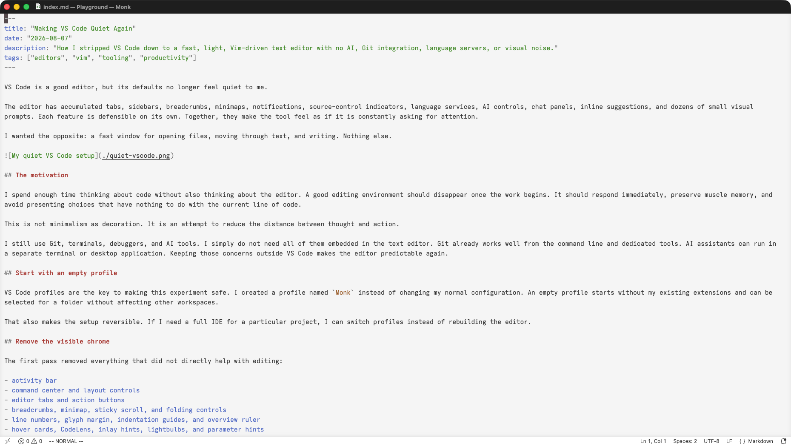

VS Code is a good editor, but its defaults no longer feel quiet to me.

The editor has accumulated tabs, sidebars, breadcrumbs, minimaps, notifications, source-control indicators, language services, AI controls, chat panels, inline suggestions, and dozens of small visual prompts. Each feature is defensible on its own. Together, they make the tool feel as if it is constantly asking for attention.

I wanted the opposite: a fast window for opening files, moving through text, and writing. Nothing else.



## The motivation

I spend enough time thinking about code without also thinking about the editor. A good editing environment should disappear once the work begins. It should respond immediately, preserve muscle memory, and avoid presenting choices that have nothing to do with the current line of code.

This is not minimalism as decoration. It is an attempt to reduce the distance between thought and action.

I still use Git, terminals, debuggers, and AI tools. I simply do not need all of them embedded in the text editor. Git already works well from the command line and dedicated tools. AI assistants can run in a separate terminal or desktop application. Keeping those concerns outside VS Code makes the editor predictable again.

## Start with an empty profile

VS Code profiles are the key to making this experiment safe. I created a profile named `Monk` instead of changing my normal configuration. An empty profile starts without my existing extensions and can be selected for a folder without affecting other workspaces.

That also makes the setup reversible. If I need a full IDE for a particular project, I can switch profiles instead of rebuilding the editor.

## Remove the visible chrome

The first pass removed everything that did not directly help with editing:

- activity bar
- command center and layout controls
- editor tabs and action buttons
- breadcrumbs, minimap, sticky scroll, and folding controls
- line numbers, glyph margin, indentation guides, and overview ruler
- hover cards, CodeLens, inlay hints, lightbulbs, and parameter hints
- inline suggestions and automatic completion popups

The result is almost entirely text. Files are opened with Quick Open, commands come from the Command Palette, and the file explorer is available when I explicitly ask for it.

Here is the shape of the visual configuration:

```json
{
  "workbench.activityBar.location": "hidden",
  "workbench.editor.showTabs": "none",
  "workbench.editor.editorActionsLocation": "hidden",
  "breadcrumbs.enabled": false,
  "editor.fontSize": 18,
  "editor.lineNumbers": "off",
  "editor.glyphMargin": false,
  "editor.folding": false,
  "editor.minimap.enabled": false,
  "editor.stickyScroll.enabled": false,
  "editor.scrollbar.vertical": "hidden",
  "editor.scrollbar.horizontal": "hidden",
  "editor.renderLineHighlight": "none"
}
```

## Remove the background work too

A visually minimal editor can still do a surprising amount of work behind the scenes. The next step was to remove services rather than merely hide their buttons.

The `Monk` profile disables Git and GitHub integration, Emmet, debuggers, task detection, npm helpers, notebooks, media previews, merge helpers, authentication services, and built-in language servers. It also has no third-party extensions except VSCodeVim.

Generated directories are excluded from file watching and search:

```json
{
  "files.watcherExclude": {
    "**/.git/**": true,
    "**/node_modules/**": true,
    "**/.venv/**": true,
    "**/__pycache__/**": true,
    "**/target/**": true,
    "**/dist/**": true,
    "**/build/**": true
  },
  "search.followSymlinks": false,
  "git.enabled": false,
  "task.autoDetect": "off",
  "typescript.disableAutomaticTypeAcquisition": true,
  "workbench.localHistory.enabled": false
}
```

This matters most when opening a large parent directory containing several projects. The better habit is still to open one repository at a time, but aggressive exclusions stop dependency trees and build artifacts from becoming the editor's concern.

## No AI inside the editor

I use AI extensively, but I do not want it present in every surface where I write code. Inline predictions interrupt my flow, and chat controls turn the editor into another assistant dashboard.

VS Code now has a master switch for this:

```json
{
  "chat.disableAIFeatures": true,
  "chat.agent.enabled": false,
  "chat.agentHost.enabled": false,
  "github.copilot.enable": {
    "*": false
  },
  "github.copilot.nextEditSuggestions.enabled": false
}
```

I also disabled the Codex, Claude, and Copilot agent hosts, AI plugins, voice features, session sync, and AI recommendations. This is not a rejection of AI. It is a boundary: the editor is where I write and inspect code; AI lives beside it, not inside it.

## One theme and one extension

The visual system is equally constrained. The profile uses only **Quiet Light**, with automatic dark-mode switching disabled. Every other built-in color-theme package is disabled.

Quiet Light gives me a clear white canvas without trying to make the code look dramatic. I increased the editor font to 18 pixels and made the status bar white so the entire window feels like one continuous surface.

The only executable extension is VSCodeVim. I kept its core modal editing and removed its optional extras: no EasyMotion, Sneak, Surround, Neovim bridge, relative-number switching, marks gutter, or yank animation.

I initially removed the bottom status bar too. That went too far. In a modal editor, `NORMAL`, `INSERT`, and search-match feedback are useful state rather than decoration. The status bar came back, but its mode-based colors stayed disabled. This was a useful reminder that minimalism should preserve information that prevents mistakes.

## Install the complete profile

I published the [complete Monk profile as a GitHub Gist](https://gist.github.com/vinitkumar/0a6940afafc25b1f905516dfb4b41dbd). It includes the full [`settings.json`](https://gist.githubusercontent.com/vinitkumar/0a6940afafc25b1f905516dfb4b41dbd/raw/05202fb9db9e6eda315105f6a7cfc25d4e0e9735/settings.json), the list of disabled built-in extensions, and a small installer.

Read the revision-pinned script first:

```sh
curl -fsSL https://gist.githubusercontent.com/vinitkumar/0a6940afafc25b1f905516dfb4b41dbd/raw/86c45543167d49f347c8bd7801ebf879e25cffc6/install.sh | less
```

Then install it:

```sh
curl -fsSL https://gist.githubusercontent.com/vinitkumar/0a6940afafc25b1f905516dfb4b41dbd/raw/86c45543167d49f347c8bd7801ebf879e25cffc6/install.sh | sh
```

The script supports macOS and Linux and requires the `code`, `curl`, and `sqlite3` commands. It creates or updates only a profile named `Monk`, installs VSCodeVim there, verifies the downloaded settings with SHA-256, and backs up existing Monk settings and state before replacing them. It does not modify the default profile.

The built-in extension state matters because `settings.json` alone cannot turn VS Code's bundled language services, Git integration, debuggers, and extra themes off. The installer writes that profile-local state as well, leaving Quiet Light and VSCodeVim as the useful parts.

The faint window transparency in my screenshot is the one non-portable exception. It comes from an application-wide Electron customization, not the Monk profile, and VS Code updates can reset it. I intentionally left that patch out of a remote shell installer.

## What I gave up

This profile is intentionally not an IDE. It has no code completion, diagnostics, hover documentation, automatic imports, integrated Git status, debugger, or AI assistance. Some projects genuinely benefit from those tools, and a different profile is one command away.

The important part is that the quiet profile does not slowly grow into the full profile again. Every addition must justify its startup cost, visual footprint, and claim on attention.

For general writing, code reading, small edits, and work where I want to think without prompts, this setup is enough. The editor opens files, searches text, navigates quickly, and gets out of the way.

## The larger point

Modern developer tools often compete by adding capabilities. The harder and more personal work is deciding which capabilities should be absent.

Fast software is pleasant, but predictable software is calming. A tool becomes predictable when it has fewer hidden jobs, fewer modes imposed by plugins, and fewer reasons to interrupt you. That calm compounds over a working day.

My final VS Code setup is almost comically plain: Quiet Light, a large font, Vim keys, a white status bar, and a text buffer. That is exactly what I wanted.

The editor is no longer the workspace. It is simply the place where text changes.
