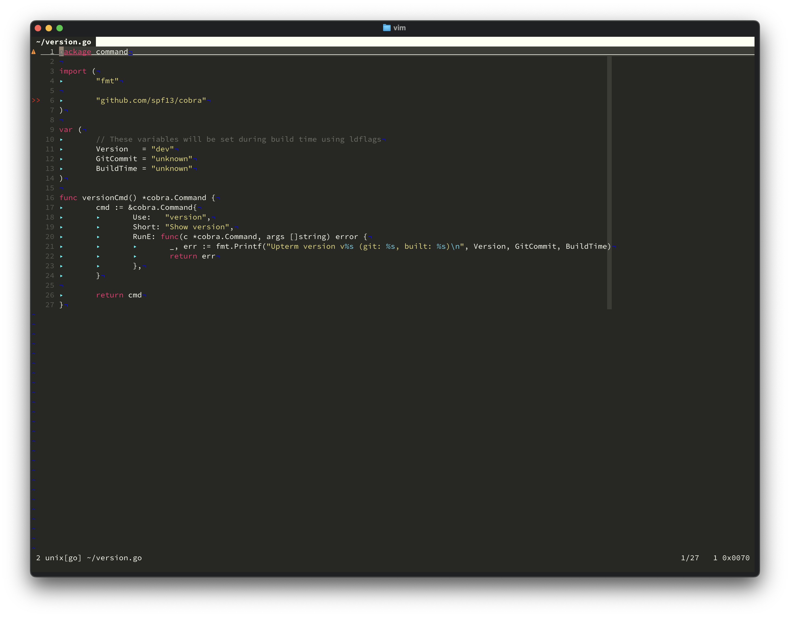
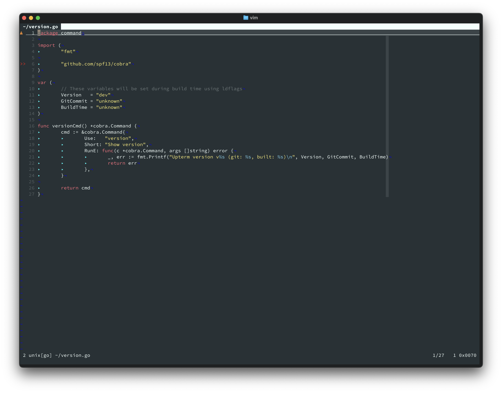
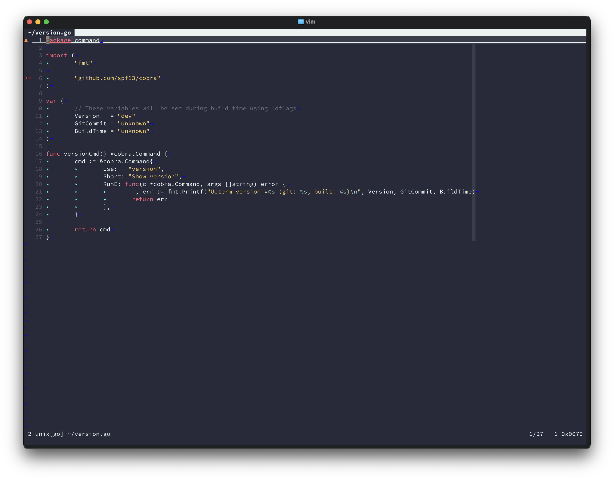
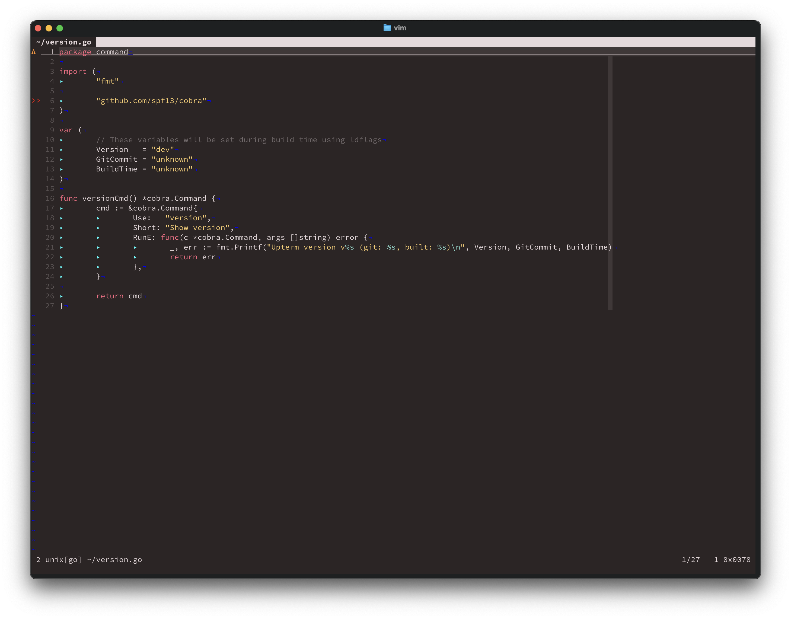
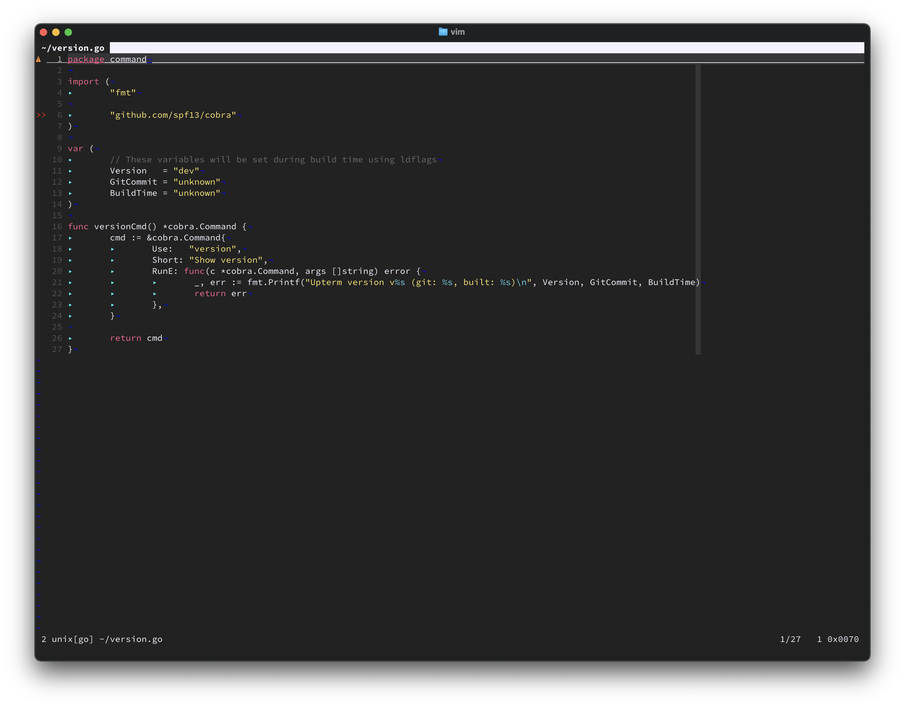
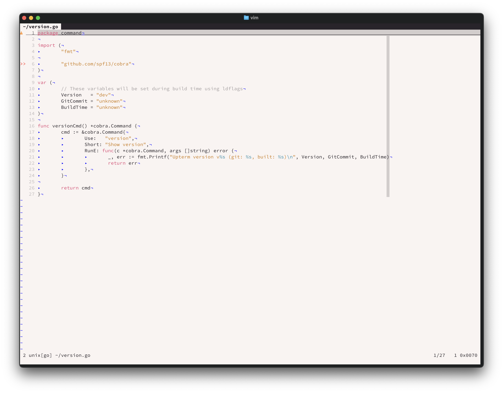

I've always believed that the right colorscheme makes a profound difference in how we write code. After years of switching between various themes, I found myself constantly drawn back to Monokai Pro in VSCode. Its carefully crafted color palette strikes the perfect balance between vibrant syntax highlighting and comfortable readability.

I wrote this theme in vim colorscheme based on the work from [gthelding](https://github.com/vinitkumar/monokai-pro-vim?tab=readme-ov-file)

But here's the thing - I spend most of my coding time in Vim. The existing Monokai ports never quite captured what made the Pro version special. So I decided to create a faithful port that brings all six Monokai Pro filters to Vim and Neovim.

## Why Another Monokai Theme?

Monokai Pro isn't just another colorscheme. It represents years of refinement by its original creator, with each color carefully chosen to reduce eye strain while maintaining excellent contrast. The Pro version introduced "filters" - subtle variations that cater to different preferences and lighting conditions.

My port maintains these design principles while ensuring compatibility with both Vim 8+ and Neovim. Every highlight group has been meticulously mapped to preserve the original's aesthetic integrity.

## Six Filters, Six Moods

The beauty of Monokai Pro lies in its versatility. Each filter offers a distinct personality while maintaining the core Monokai DNA:

### Classic
The original that started it all. Rich, vibrant colors with that signature Monokai warmth.



### Machine
Cool, muted tones perfect for late-night coding sessions. This filter reduces blue light while maintaining excellent readability.



### Octagon
A warmer take with enhanced contrast. Ideal for bright environments or when you need that extra bit of visual clarity.



### Ristretto
Deep, coffee-inspired browns and creams. This filter feels like coding in your favorite café.



### Spectrum
Bold and vibrant, pushing saturation to create a more energetic coding environment.



### Light
Yes, a light theme! For those sunny days or well-lit offices where dark themes just don't work.



## Installation and Usage

Getting started is straightforward. If you're using vim-plug:

```vim
Plug 'vinitkumar/monokai-pro-vim'
```

For Packer.nvim users:

```lua
use 'vinitkumar/monokai-pro-vim'
```

Once installed, switching between filters is simple:

```vim
" Set your preferred filter
colorscheme monokai-pro-classic
" or
colorscheme monokai-pro-machine
" or any other filter
```

## Technical Implementation

Creating a faithful port required careful attention to detail. Each highlight group maps to its VSCode equivalent, ensuring consistency across editors. The theme supports:

- Full TreeSitter integration for Neovim
- Language-specific optimizations for Python, JavaScript, Go, and more
- Plugin support for popular tools like NERDTree, fzf, and telescope.nvim
- Terminal color integration for a cohesive experience

The implementation uses Vim's native colorscheme architecture, avoiding external dependencies. This ensures fast loading times and broad compatibility.

## Design Philosophy

A good colorscheme does more than just look pretty. It should:

1. Reduce cognitive load by using color consistently
2. Highlight important syntax elements without overwhelming
3. Maintain readability across different file types
4. Work well in various lighting conditions

Monokai Pro achieves all of these goals through its thoughtful color choices and semantic highlighting approach.

## Future Development

This initial release focuses on core functionality and accuracy. Future updates will include:

- Additional plugin integrations
- Performance optimizations for large files
- Custom filter creation tools
- Better documentation for theme customization

## Try It Today

The theme is available on [GitHub](https://github.com/vinitkumar/monokai-pro-vim). I've love it, and it's transformed my Vim experience.

Whether you're a long-time Monokai fan or just exploring colorscheme options, give it a try. Your eyes will thank you.

---

*Found this useful? Star the [repository](https://github.com/vinitkumar/monokai-pro-vim) or report issues to help improve it.*
