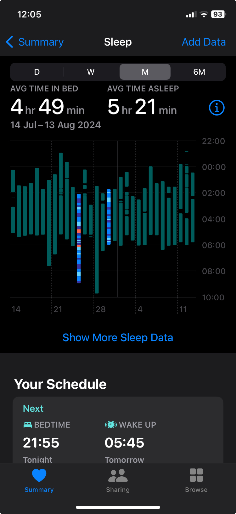
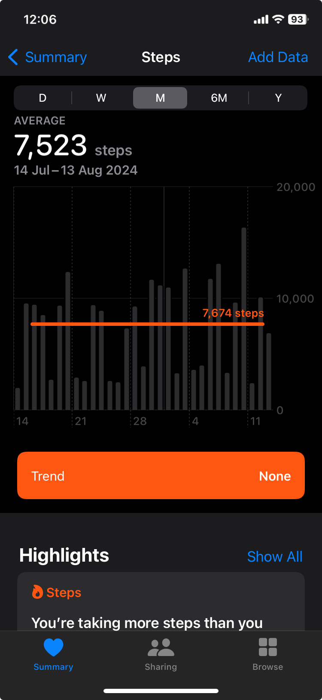

This past month has been quite interesting. Work-wise, it was decent—some good moments and some not-so-great ones. We switched back to a more structured way of working after trying out something new. While many people might dislike Scrum for good reasons (like all the meetings), it does bring some order to the chaos. The alternative we tried was even messier.

On a personal note, my wife and I have managed to keep up a fairly consistent routine of walking five days a week, except when one of us is sick. However, our sleep quality and duration are still a concern. We always end up going to bed late and waking up early, so sometimes we need to make up for it with an afternoon nap. We’ll try to improve this in the coming months.

Financially, our expenses have increased a bit, and we need to get them under control. We're not in bad shape, but we need to be more careful and frugal. I've also been struggling with motivation, which has been a persistent worry. I'm trying to cut motivation out of the equation altogether since it's proven to be an unreliable ally.

On a lighter note, we watched "Deadpool" and a "Wolverine" movie recently, and they were a lot of fun.

My guitar skills are improving, and I hope to be able to play some decent songs—both chords and solos—in the coming months.

One thing I really want to focus on is reading and writing more. I have a great collection of books, but I just can't seem to find the time to read them. I’m thinking I should start by reading a few pages a day and see how it goes. I also need to seriously cut down on social media use. It's such a time-waster and always leaves me feeling bad.

Here are some screenshots of the last month walking and sleep data:

