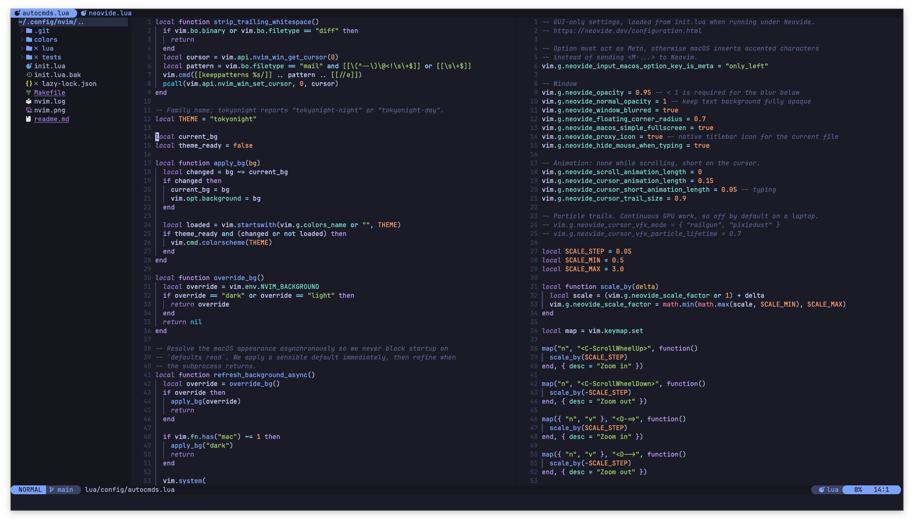

In my [new year post](/new-year/) I wrote that I was happy with my Neovim setup and didn't want to spend endless hours rearranging it anymore.

Well. I went through the git log of my [nvim config](https://github.com/vinitkumar/nvim) today and there are 12 commits since the end of June. In my defense, most of them removed things. But I should still write down what changed, mostly so that future me knows why the config looks the way it does.

## It started with startup time

Neovim had started to feel a little slow to open. Not slow like an IDE, but slow enough that I noticed it, and once you notice it you can't stop noticing it.

The cause was boring. Too many things were loading at startup that had no business being there. My LSP config was loaded on every launch, even if I was only opening a text file to write a note. The colorscheme pulled in Lush and Zenbones before there was even a UI to paint. Treesitter, indent-blankline and the color highlighter were all on `BufReadPost`, which in practice means always.

So now nothing loads until something needs it. The LSP config sits behind a one-shot autocmd:

```lua
vim.api.nvim_create_autocmd("FileType", {
  pattern = lsp_filetypes.supported,
  once = true,
  callback = function()
    require("config.lsp")
  end,
})
```

The colorscheme loads on `UIEnter`, the plugins load for the filetypes where they are actually useful, and treesitter skips any buffer over 5000 lines. I also turned off the builtin plugins I have never used in my life: gzip, tar, zip, tutor, tohtml and netrw.

Then I did something I had never done for an editor config before. I wrote tests for it. `init.lua` records the time on its very first line, and a spec fails if startup takes more than 50 ms:

```lua
local startup_ms = (vim.uv.hrtime() - vim.g.config_start_time_ns) / 1e6
assert(startup_ms < 50, ("expected config startup under 50 ms, got %.1f ms"):format(startup_ms))
```

It also checks that the finder plugins and `vim.lsp` are still unloaded after startup, and that `<leader>g` really does open the git files picker. `make test` runs all of it headless with an empty cache directory, so every run is a cold start.

A normal warm start is around 26 ms on my machine. The cold-start test is tight enough that it sometimes fails when the laptop is busy doing something else. I'm leaving it like that for now. I would rather have a test that complains a bit too much than find out in December that startup doubled and have no idea which commit did it.

## Deleting what Neovim does on its own now

This was the most satisfying commit of the lot. A good chunk of my config had been carried along since my Vim days, and Neovim 0.12 simply doesn't need it:

- autocmds that set the filetype for `.tsx`, `.yaml` and `.md` files
- three lines setting the encoding to UTF-8, which is already the default
- vim-commentary, since `gc` is built in
- my own `K` and `grx` mappings, which are default LSP mappings now
- a Linux-only fzf-lua fallback that had been broken for I don't know how long

21 lines added, 35 removed. I also moved completion over to the native fuzzy matching, and diagnostics now use `virtual_lines` only for the line the cursor is on. You get the full error message right under the line you are on, and the rest of the file stays clean.

## No more fork

In March I wrote about [forking fff.nvim](/fff-nvim-fork/) to add the pickers I missed from fzf.vim. Keeping a fork in sync with a fast-moving upstream got old quickly. I was building it with cargo on every machine and rebasing my branch every time upstream moved.

So the pickers now live in [fff-plus.nvim](https://github.com/vinitkumar/fff-plus.nvim), a separate plugin that sits on top of upstream fff, and the config went back to plain upstream, which downloads a prebuilt binary. No Rust toolchain needed. I also added [tgrep.nvim](https://github.com/vinitkumar/tgrep.nvim) for project grep. `<leader>tw` greps the word under the cursor, which is the thing I actually do twenty times a day.

trouble.nvim and vim-fugitive are in as well. Fugitive should never have left.

## Colorschemes, again

I can't write a post about my config without confessing to this one. Over the summer I wrote a whole 475-line colorscheme called `bright`, with a test for it, used it for a couple of weeks, moved to solarized-osaka, and have now landed on [tokyonight](https://github.com/folke/tokyonight.nvim). It follows the macOS appearance, so it's the night variant in dark mode and day in light mode.

My lualine had a hardcoded color palette that only looked right with one theme. The black bars looked terrible with everything else. It just follows the colorscheme now. It also shows the open buffers on top, and a red dot when I'm recording a macro, because I have ruined more than one file by forgetting that I was.

The font is JetBrains Mono, with Maple Mono NF as the fallback for the icon glyphs.

I turned a lot of things off too. Relative numbers, cursorline, whitespace markers, soft wrap, the fold column. Same idea as my [quiet VS Code](/making-vscode-quiet-again/) experiment. I want the code on the screen and not much else.

## Neovide

I have been trying [Neovide](https://neovide.dev/) as a GUI. Its settings are all `vim.g` variables that terminal Neovim ignores, so they sit in their own file that only loads when `vim.g.neovide` is set.

If you are on a Mac, the one setting you really need is `neovide_input_macos_option_key_is_meta`. Without it the Option key types accented characters instead of sending Alt mappings, and that took me longer to figure out than I'd like to admit. Other than that: a bit of window blur, a short cursor animation, no scroll animation (it makes me dizzy), and Cmd-V, Cmd-C, Cmd-S so that my hands don't have to think.

## Living on the nightly

The latest change is the editor itself. I installed the Neovim nightly using [bob](https://github.com/MordechaiHadad/bob):

```bash
bob use nightly
```

```
NVIM v0.13.0-dev-1651+gcb76690546
```

bob puts its own `nvim` first in the `PATH`. Homebrew's 0.12.5 is still installed behind it in case the nightly breaks on me, which means the config has to work on both. So anything that exists only in 0.13 goes behind a version check:

```lua
if vim.fn.has("nvim-0.13") == 1 then
  vim.opt.shortmess:append("u") -- silence undo/redo messages
end
```

I'm using two things from 0.13 so far. The `u` flag above, which stops the undo and redo messages from flashing at the bottom of the screen. And `vim.hl.hl_op()` together with the new `TextPutPost` event, so both yanked and pasted text get a quick flash. Until now only yank could do that.

The nightly also bit me within the first hour. The builtin `zipPlugin` got renamed to `zip`, so my list of disabled plugins quietly stopped disabling it. I only caught it because I was already in there poking at startup. Both names are on the list now, and the test checks that neither one loads.

## That's it

Not a huge amount of work for three months, and honestly that's how I want it. Some of these commits were done with Codex and Claude doing the typing while I reviewed, which is a fine use of them for this kind of chore. The editor opens instantly, the screen is quiet, and the config is smaller than it was in June.

Now I should really stop touching it. Let's see how long that lasts.
