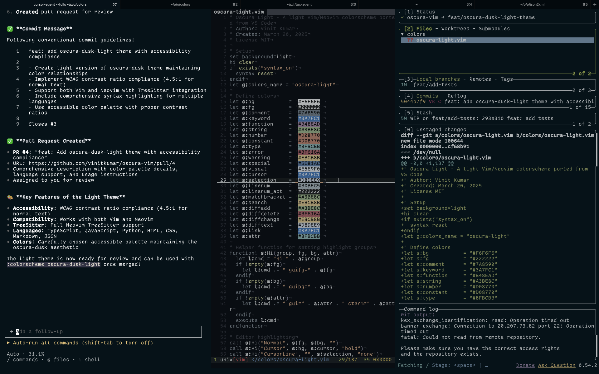

I'm changing how I work with AI, and it's about time.

The shift involves working with three or more panes depending on screen resolution, but more importantly, it's about returning to the command line where I feel most comfortable.

## The Problem with Editor-Based AI

I've never been a fan of VSCode. Since Cursor Agent is built on VSCode, I had to use it, but I never enjoyed the experience. I'm much more comfortable writing code in Vim, and I've always preferred command-line tools over GUI-based solutions.

The irony is that I don't actually need AI integrated into my editor. Modern AI tools like Claude Code, AMP Code, Gemini CLI, and even Cursor Agent work perfectly from the command line. There's no compelling reason to confine AI assistance to a single editor pane when I can keep it running in a dedicated side pane.

## The New Workflow

My new setup involves multiple panes:

- **Main coding pane**: Vim for actual development
: - **AI assistant pane**: Command-line AI tools running continuously
- **LazyGit Pane**: I love to be able to see the code diff before making commits and lazygit is an amazing tool. I can also just use fugitive for git inside vim it I am on a lower resolution screen.
- **Additional panes**: For documentation, testing, or other development tasks

This approach gives me the flexibility to use AI assistance without being locked into a specific editor. I can leverage the full power of command-line AI tools while maintaining my preferred Vim workflow.

## Why This Works Better

Command-line AI tools offer several advantages:

- **Flexibility**: I can use any AI service without being tied to a specific editor
- **Consistency**: The same AI interface works across different projects and languages
- **Efficiency**: No need to switch between different editor modes or AI integrations
- **Familiarity**: Command-line tools feel natural to someone who prefers Vim
- **Zen**: I feel I work best when there are no distractions and command line is that for me.

The future of AI-assisted development isn't about cramming AI into every editor. It's about creating flexible workflows that let developers use AI tools in the way that works best for their individual preferences and development style.

I also could just swap Vim with Pycharm,WebStorm or any other **Proper** IDE and the workflow would still stay the same and modular. This is the most important part of this workflow. Tommorrow, I could just switch the AI assistant to Claude Code and Gemini CLI and nothing would change for me.
