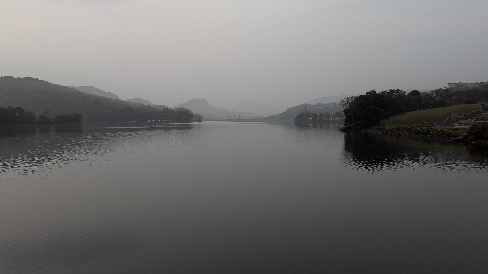
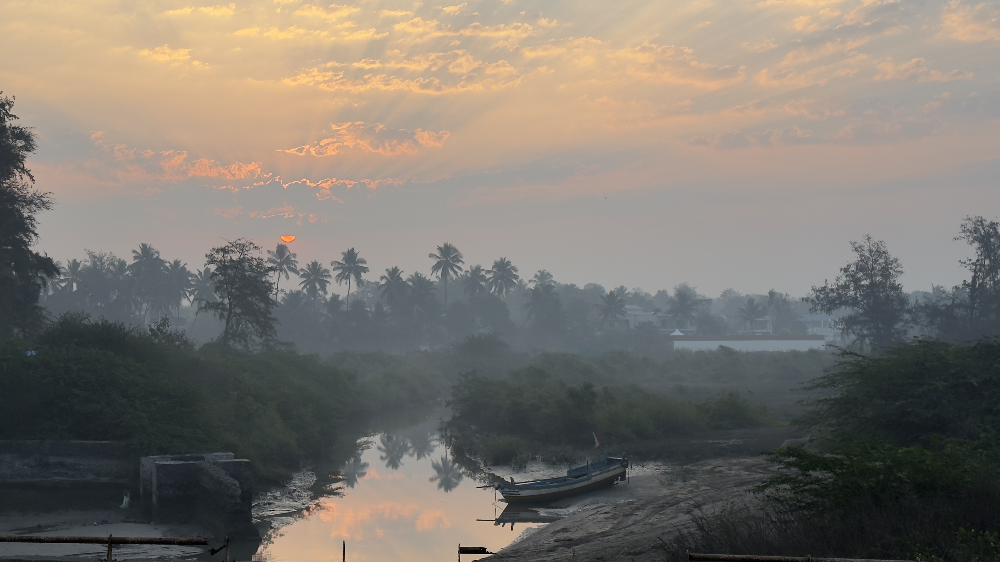

I have not written a blog in some weeks.

## What Happened

I worked on a big feature at work that took me some months of work and last couple of weeks where we took it live to production. There was an extensive round of testing and that took all my energy and attention.

## Why I Stepped Away

I realised I was doing a lot of work at work and also on open source and I started feeling a wee-bit exhausted so I thought it was best to take a break and go easy on myself. And, I am glad that I did that. All my experience tells when to step back and go easy on myself.

## What Changed

Now, as the dust has settled from the deployment, I am going to be more active in my blogs. I am also thinking of writing more general topics and not just mostly tech posts.

I also went on a couple vacations. Here are some picture from the same. Enjoy! :)

## What's Next

I am looking forward to writing more regularly and sharing my thoughts and experiences with all of you.

## Closing Thoughts

Thank you for sticking with me during the hiatus. I hope you enjoy the content I write going forward.
