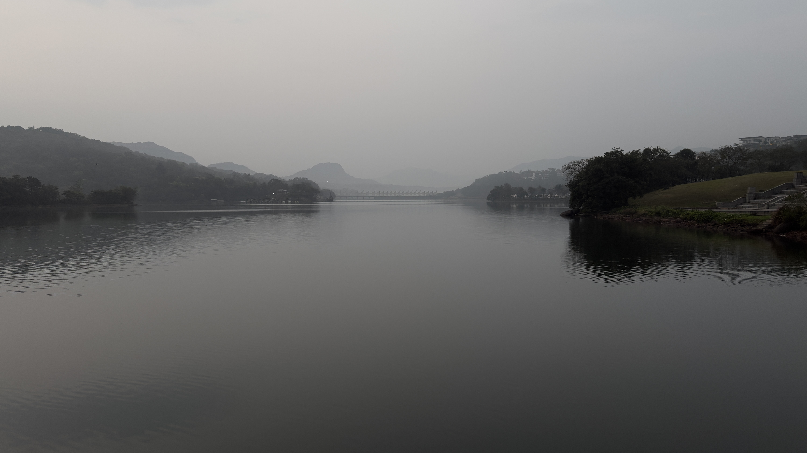
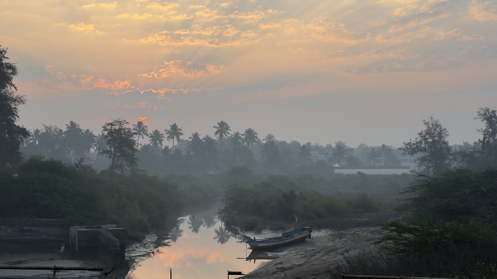

I have not published here for several weeks. The pause was unplanned, but necessary.

## Why I Stepped Away

A major feature at work demanded months of development, followed by an intense production launch and an extensive round of testing. At the same time, I was maintaining my open source commitments. Together, they consumed more energy and attention than I had available.

Once I noticed the exhaustion, I decided to stop treating every empty hour as an opportunity to produce more. Experience has taught me that stepping back early is wiser than waiting for burnout to make the decision for me.

## What the Break Gave Me

The deployment has settled, and a couple of vacations gave me room to recover. More importantly, the break reminded me that writing should help me notice and understand my life—not become another obligation inside it.

Here are a few photographs from those trips:

## What Comes Next

I am ready to write again, but I want to widen the lens. Technical essays will remain part of this site; I also want to write more about work, creativity, family, and the lessons that do not fit inside a code block.

Thank you for reading. It is good to be back.
