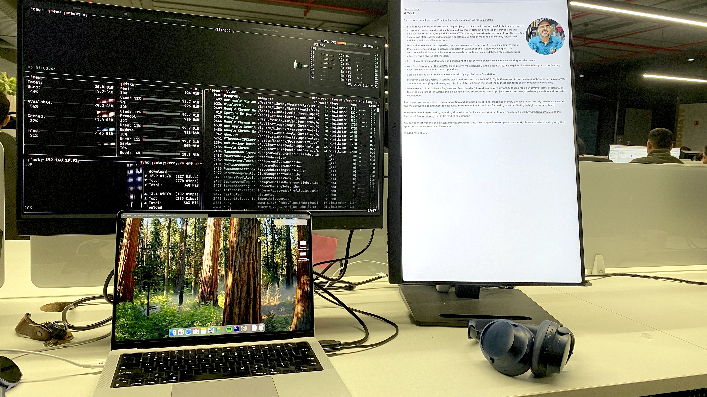

## Reflecting on My Career Journey and a New Beginning at Scalefusion

I began my professional journey in February 2013 with a Dutch company based in Pune.
As a fresh graduate, I was fortunate to find inspiring mentors like Jos, Ruben, and Jonathan, who shaped my early career.
I also had the privilege of working alongside incredible teammates such as Aashish, Robert, Edwin, Pratik, and others who became lifelong friends.

During my time there, I worked on an ambitious project, SocialSchools, which became a cornerstone of my career.
I contributed to the development of its first communication platform for schools and later led the effort to build a multi-tenant CMS from scratch.
This platform powered thousands of domains and handled millions of monthly requests, marking a significant milestone for me and the team.
In 2022, SocialSchools was acquired by KidsKonnect, and I continued contributing to their vision for the next two years.

## A Turning Point and the Path Ahead

By October 2024, it became clear that my journey with KidsKonnect would come to an end.
While contemplating my next steps, I reconnected with a company I’ve admired for years—Scalefusion.
Known for its innovative products and leadership, it felt like a natural fit for the challenges
I was eager to tackle. After a rewarding interview process, I was thrilled to accept the role of Principal Engineer.

## Gratitude and Aspirations

Reflecting on nearly 12 years at my previous company, I am deeply grateful for the mentorship,
skills, and friendships that shaped me. This experience has prepared me to embrace this next phase with confidence and ambition.

I would like to thank my wife, family, and colleagues for their unwavering support during this transition.
At Scalefusion, I look forward to reinventing myself, embracing new challenges, and achieving greater heights alongside an incredible team.

Here’s to growth, learning, and making an impact!

