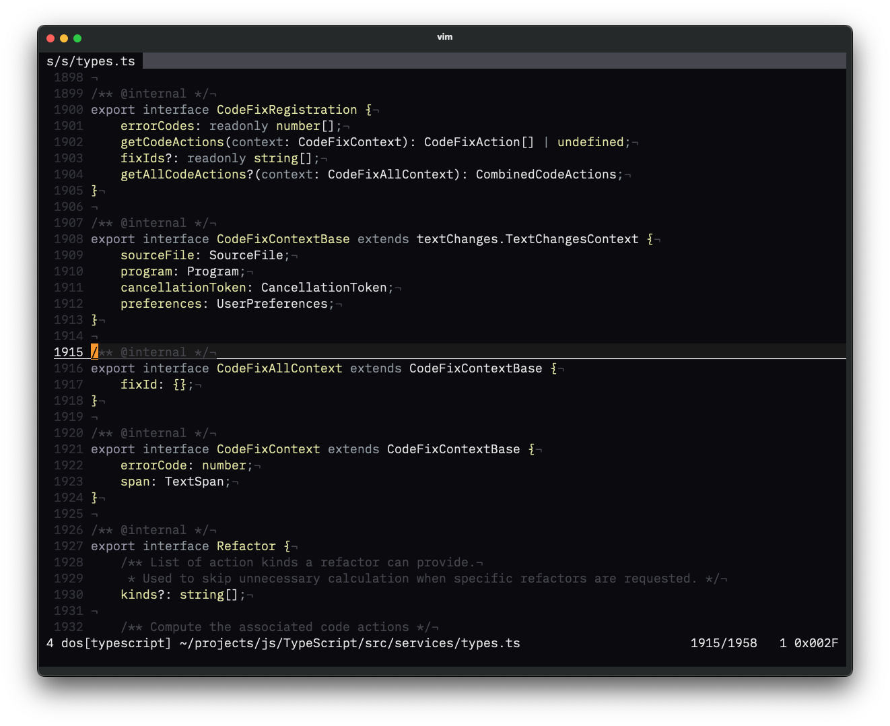
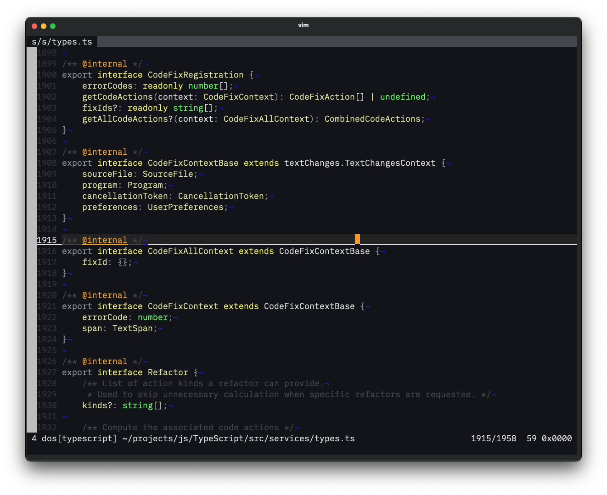

I've been coding for quite a while now, and one thing that really matters is having a comfortable theme that doesn't strain your eyes. I recently created Oscura Vim, a port of the excellent [Oscura Theme for VSCode](https://marketplace.visualstudio.com/items?itemName=Fey.oscura) by the Fey team. The original theme's meticulously curated accent colors and precisely balanced contrast inspired me to bring this sophisticated coding environment to Vim users. I also sought permission from them before publishing my port. 

<blockquote class="twitter-tweet"><p lang="en" dir="ltr">Of course! 🤝 and the port looks great</p>&mdash; T. Costa (@tcosta_co) <a href="https://twitter.com/tcosta_co/status/1902719689903534386?ref_src=twsrc%5Etfw">March 20, 2025</a></blockquote> <script async src="https://platform.twitter.com/widgets.js" charset="utf-8"></script>

## Why Another Dark Theme?

Let's be honest - there are countless dark themes out there. However, Oscura (originally crafted by the Fey team) stands out because it actually solves real problems. Following the original design principles, I've maintained two variants in the Vim port:

- **Oscura**: A deep, rich dark background (#0B0B0F) that's perfect for late-night coding sessions



- **Oscura Dusk**: A slightly lighter variant (#131419) that works well in various lighting conditions



What I particularly love about this theme is its high contrast and readability. When you're debugging a tricky issue or reviewing pull requests, the last thing you want is eye strain from poor color choices.

## Installation and Setup

Setting up Oscura is straightforward. If you're using Vim-Plug like I do, just add this to your `.vimrc`:

```vim
Plug 'vinitkumar/oscura-vim'
```

For Neovim users with Lazy.nvim (my current setup), you can configure it like this:

```lua
{
  'vinitkumar/oscura-vim',
  lazy = false,  -- We want the theme available at startup
}
```

After installation, activate the theme by adding one of these lines to your `.vimrc`:

```vim
" I prefer the original dark theme
colorscheme oscura

" Or use the dusk variant if you want slightly higher contrast
colorscheme oscura-dusk
```

## What Makes It Special?

Having used this theme for a while now, here's what stands out:

- The syntax highlighting is comprehensive and well-thought-out, especially for TypeScript and JavaScript
- Git diff highlighting is clear and intuitive
- The status line and UI elements are distinct without being distracting
- Search highlighting actually helps you find things instead of hiding them

## Real-world Usage

I've been using Oscura during my daily coding sessions, and it's made a noticeable difference. The theme maintains good contrast even during those long debugging sessions when you're trying to track down a particularly nasty bug. The enhanced TypeScript support is particularly useful since that's what I work with most days.

Sometimes, I switch between the original Oscura and Oscura Dusk depending on the time of day and lighting conditions. The Dusk variant works better during daytime, while the original dark theme is perfect for those late-night coding sessions.

## A Note on Requirements

Make sure your Vim setup supports true colors - it makes a huge difference in how the theme renders. You'll need Vim 7.4 or later, but honestly, you should be on a much newer version anyway.

If you're looking for a comfortable, eye-friendly dark theme that doesn't compromise on readability, give Oscura a try. It's become an essential part of my development setup, and I think you'll appreciate it too.

## Credits

This Vim colorscheme is based on the [Oscura Theme for VSCode](https://marketplace.visualstudio.com/items?itemName=Fey.oscura) created by the Fey team. Their original design's color palette and principles guided this Vim port. If you're a VSCode user, I highly recommend checking out their original theme.

Cheers! 🤘 