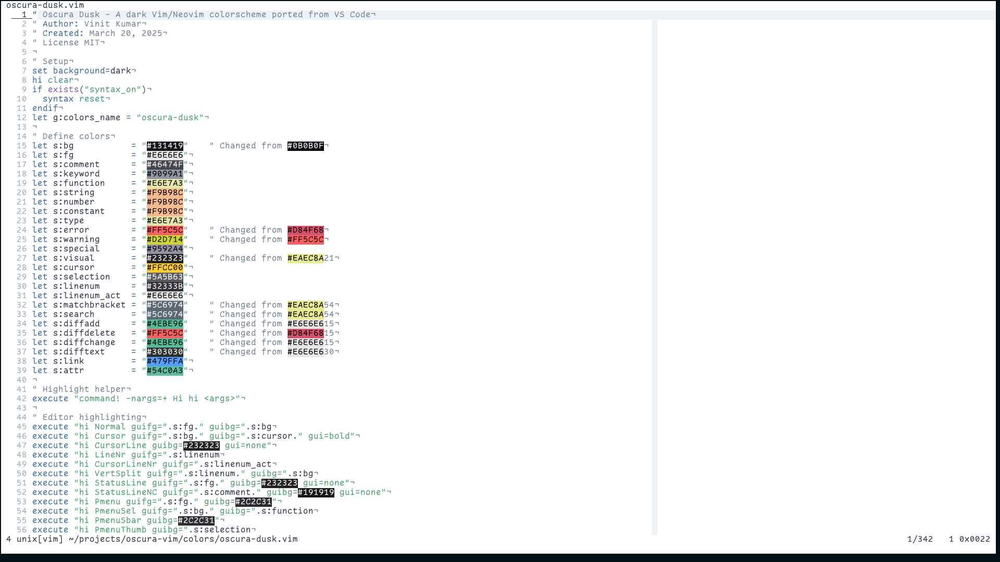
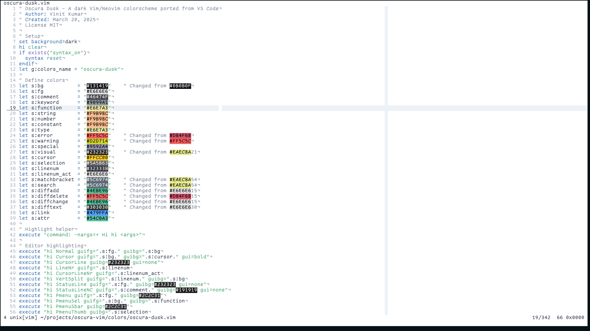

I've been coding for quite a while now, and one thing that really matters is having a comfortable theme that doesn't strain your eyes. I recently created Oscura Vim, a port of the excellent [Oscura Theme for VSCode](https://marketplace.visualstudio.com/items?itemName=Fey.oscura) by the Fey team. The original theme's meticulously curated accent colors and precisely balanced contrast inspired me to bring this sophisticated coding environment to Vim users. I also sought permission from them before publishing my port. 

<blockquote class="twitter-tweet"><p lang="en" dir="ltr">Of course! 🤝 and the port looks great</p>&mdash; T. Costa (@tcosta_co) <a href="https://twitter.com/tcosta_co/status/1902719689903534386?ref_src=twsrc%5Etfw">March 20, 2025</a></blockquote> <script async src="https://platform.twitter.com/widgets.js" charset="utf-8"></script>

## Why Another Theme Collection?

Let's be honest - there are countless themes out there. However, Oscura (originally crafted by the Fey team) stands out because it actually solves real problems. Following the original design principles, I've maintained four variants in the Vim port:

### 🌙 Dark Themes

- **Oscura**: A deep, rich dark background (#0B0B0F) that's perfect for late-night coding sessions


- **Oscura Dusk**: A slightly lighter variant (#131419) that works well in various lighting conditions


### ☀️ Light Themes (NEW!)

I'm excited to announce that I've added two new light mode variants to the collection:

- **Oscura Light**: A clean, modern light theme designed for bright environments. Provides excellent readability with a professional appearance.



- **Oscura Dusk Light**: A warm light variant with dusk-inspired colors. Perfect for users who want the benefits of a light theme with warmer, more comfortable tones.



What I particularly love about this theme collection is its high contrast and readability across all variants. When you're debugging a tricky issue or reviewing pull requests, the last thing you want is eye strain from poor color choices.

## Installation and Setup

Setting up Oscura is straightforward. If you're using Vim-Plug like I do, just add this to your `.vimrc`:

```vim
Plug 'vinitkumar/oscura-vim'
```

For Neovim users with Lazy.nvim (my current setup), you can configure it like this:

```lua
{
  'vinitkumar/oscura-vim',
  lazy = false,  -- We want the theme available at startup
}
```

After installation, activate any of the four themes by adding one of these lines to your `.vimrc`:

```vim
" Dark themes
colorscheme oscura          " Classic dark
colorscheme oscura-dusk     " Dark dusk variant

" Light themes (NEW!)
colorscheme oscura-light    " Classic light
colorscheme oscura-dusk-light " Light dusk variant
```

### Auto-switching Based on Time

You can even set up automatic theme switching based on the time of day:

```vim
function! SetOscuraTheme()
  let hour = str2nr(strftime('%H'))
  if hour >= 6 && hour < 18
    " Daytime - use light theme
    colorscheme oscura-light
  else
    " Nighttime - use dark theme
    colorscheme oscura
  endif
endfunction

" Call on startup
call SetOscuraTheme()
```

## What Makes It Special?

Having used this theme collection for a while now, here's what stands out:

- **4 Complete Themes**: 2 dark + 2 light variants to suit any preference or lighting condition
- **Optimized for Productivity**: Designed for long coding sessions with excellent eye comfort
- **High Contrast**: Excellent readability in all lighting conditions
- **Comprehensive Syntax Highlighting**: Support for 50+ programming languages
- **Modern UI Support**: Status lines, line numbers, popup menus, and more
- **Git Integration**: Enhanced diff highlighting and merge conflict markers
- **Search & Visual Mode**: Clear highlighting for search results and selections
- **Plugin Compatibility**: Works with popular plugins like LSP, Treesitter, and more

## Real-world Usage

I've been using Oscura during my daily coding sessions, and it's made a noticeable difference. The theme maintains good contrast even during those long debugging sessions when you're trying to track down a particularly nasty bug. The enhanced TypeScript support is particularly useful since that's what I work with most days.

With the new light themes, I can now seamlessly switch between dark and light modes depending on my environment. The light variants are perfect for bright office environments or daytime coding, while the dark themes remain ideal for late-night sessions.

Sometimes, I switch between the original Oscura and Oscura Dusk depending on the time of day and lighting conditions. The Dusk variants work better during transitional periods, while the classic variants are perfect for consistent lighting environments.

## A Note on Requirements

Make sure your Vim setup supports true colors - it makes a huge difference in how the theme renders. You'll need Vim 7.4 or later, but honestly, you should be on a much newer version anyway.

If you're looking for a comfortable, eye-friendly theme collection that doesn't compromise on readability and offers both dark and light options, give Oscura a try. It's become an essential part of my development setup, and I think you'll appreciate it too.

## Credits

This Vim colorscheme collection is based on the [Oscura Theme for VSCode](https://marketplace.visualstudio.com/items?itemName=Fey.oscura) created by the Fey team. Their original design's color palette and principles guided this Vim port. If you're a VSCode user, I highly recommend checking out their original theme.

Cheers! 🤘 
