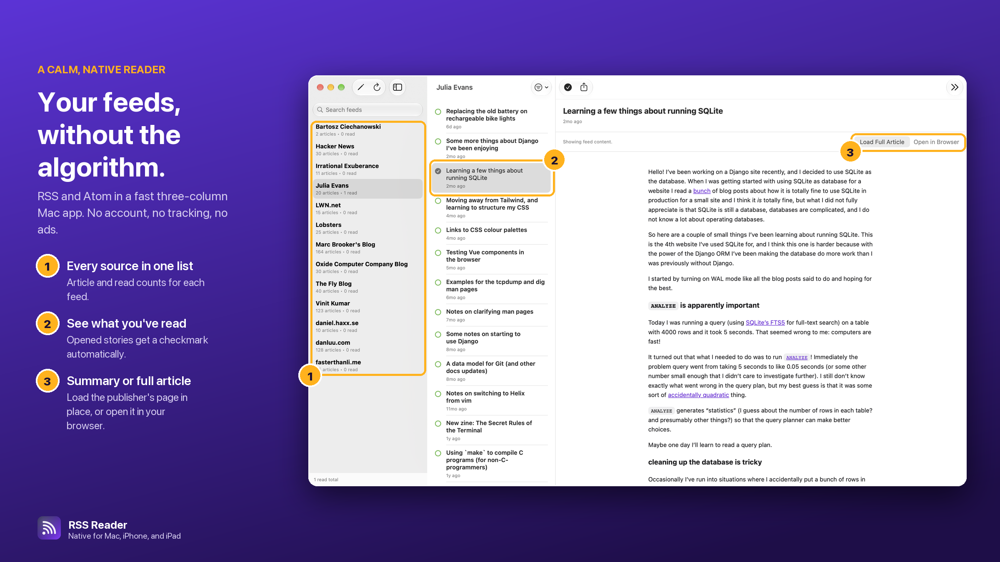
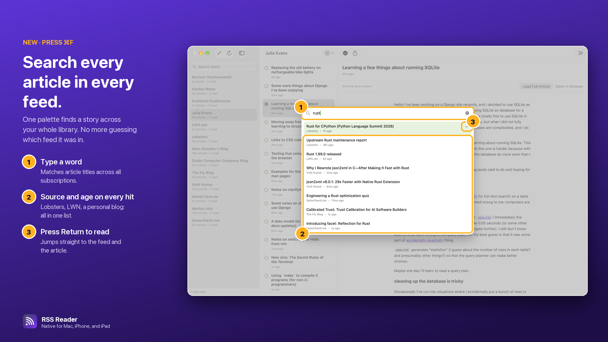
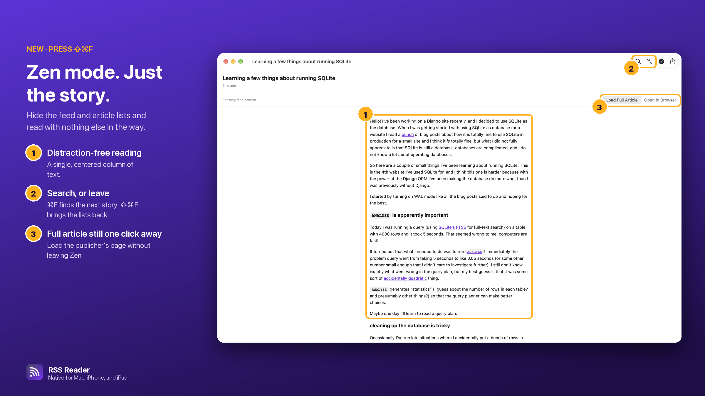
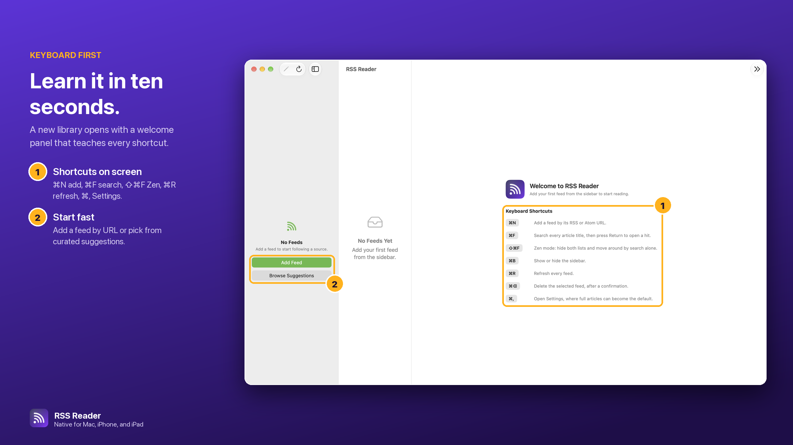
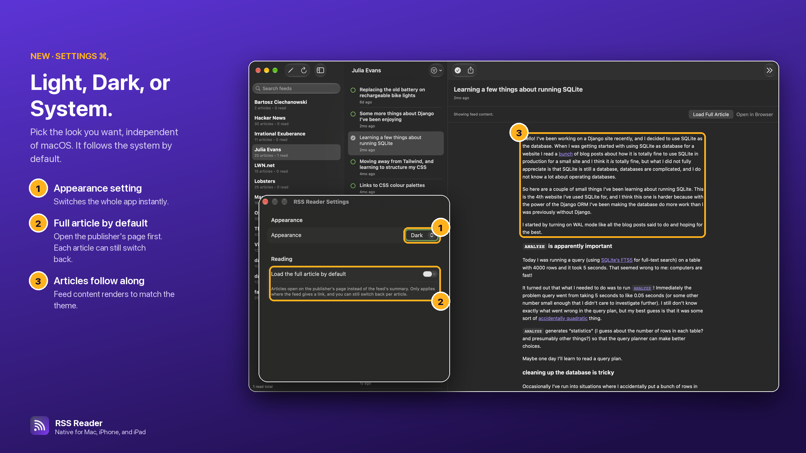

On March 19 I made the first commit to a small Mac app that reads RSS and Atom feeds. I wanted one thing from it: open a window, see what the people I follow have written, and read it. No account, no sync service, no algorithm deciding what I see first.

Six months and around eighty commits later, it runs on the Mac, iPhone, and iPad.

## The rules

I set three rules on day one, and they have held up.

**No third-party dependencies.** Foundation's `XMLParser` handles RSS 2.0 and Atom fine. WebKit renders articles. SQLite stores them. Everything else is SwiftUI. Nothing to audit, nothing to update on a Tuesday because a transitive package broke.

**Everything stays local.** Feeds and articles are cached in SQLite on the device. Read state lives in preferences. The app talks to the feeds you add and to nothing else.

**Native, not "cross-platform".** It looks and behaves like a Mac app on the Mac and like an iPhone app on the iPhone, because it uses the system's own controls everywhere.

## It started as a Newsboat replacement

My feeds lived in Newsboat, in a plain `urls` file. The second feature I wrote, the day after the first commit, was an importer for that file. Point it at `~/.config/newsboat/urls` and the whole library comes across in one go. It reads the first field of each line and skips comments, which is all the format needs.

Then the real work started, which was mostly the long tail of how feeds actually behave in the wild:

- Some blogs put half the post in `description` and the full post in `content:encoded`. The parser prefers the full version.
- Some feeds write relative image and article links. The web view now gets the feed's own address as its base URL, so images show up and links go where they should.
- Importing a list that overlaps your library should not create the same feed twice. Duplicates are detected and skipped.
- Refreshes run concurrently with a `TaskGroup`, so cache writes are serialized to keep two feeds from stepping on each other.

None of this is glamorous. All of it is the difference between a demo and an app you trust.

## One view hierarchy for three platforms

The app started life as a Swift package for the Mac. In April I moved it to a proper Xcode project with a test target. In July I ported it to iPhone and iPad, at first with a separate iOS view tree.

Two view trees meant every feature was written twice and drifted once. So in September I deleted that and unified everything into a single adaptive hierarchy. A `NavigationSplitView` shows three columns on the Mac and on a wide iPad, and collapses into a normal navigation stack on iPhone and in narrow iPad split screen. One codebase, one set of bugs.

The screenshot at the top of this post is the whole app on the Mac. Every source sits in one list with its article and read counts. Opening a story marks it read with a checkmark, and new posts since the last refresh get a `NEW` badge. The article pane shows the feed's own content, with **Load Full Article** to pull in the publisher's page in place and **Open in Browser** when you want the real thing. That is most of the UI, on purpose.

## What shipped in the last week

Version 1.2.0 went out on September 29. It added starter feeds for new libraries (Hacker News and Lobsters), curated suggestions, editable feed titles and URLs, and validation when you add a feed, so a typo gets caught before it becomes a broken subscription. On the Mac you can now make RSS Reader the default handler for `feed:` links, and they open in the existing window instead of spawning a new one.

Version 1.3.0 followed on October 3, and it is the bigger of the two.

### Search every article in every feed

Command-F opens one palette that matches article titles across every subscription. Each hit shows its source and age, so Lobsters, LWN, and a personal blog sit in one list. Return jumps straight to the feed and the article.

### Zen mode

Shift-Command-F hides the feed and article lists and leaves a single centered column of text. Command-F still finds the next story, so search becomes the way between stories, and Shift-Command-F brings the lists back. Load Full Article still works without leaving Zen.

### A welcome that teaches the shortcuts

An empty library used to be a blank window. Now it opens with a welcome panel that lists every shortcut: Command-N to add a feed, Command-F to search, Shift-Command-F for Zen, Command-R to refresh, Command-Comma for Settings. The sidebar offers Add Feed and Browse Suggestions, so you can start from a URL or from the curated list. Command-N also adds a feed now, instead of opening a second window.

### Settings, and soon an appearance of your own

1.3.0 added a Settings screen with one option: open articles on the publisher's page by default instead of the feed's summary. Each article can still switch back.

The next release adds Light, Dark, or System, independent of the system setting and following it by default. On the Mac it sets the appearance for the whole app, so every window switches at once, the Settings window included, and article content renders to match.

## Tests, for an RSS reader

The core of the app has CI and a coverage gate. The feed models, the parser, the date parser, the SQLite layer, and the store all have to stay above 85% line coverage or the build fails. Dates alone justified this: RSS uses RFC 822, Atom uses ISO 8601, and real feeds use both, sometimes badly.

Even the Settings screen has tests now. One of them puts the window on screen and checks that changing the stored appearance actually changes the app's appearance, because "the picker shows Dark" and "the app is dark" are two different claims.

## Why bother

There are good RSS readers already. I built this one because I wanted a reader that does less, starts fast, keeps my data on my machines, and that I can change in an afternoon when something bugs me. Every feature in it exists because I hit the problem myself.

RSS is still the best way I know to follow people who write. It deserves software that gets out of the way.
