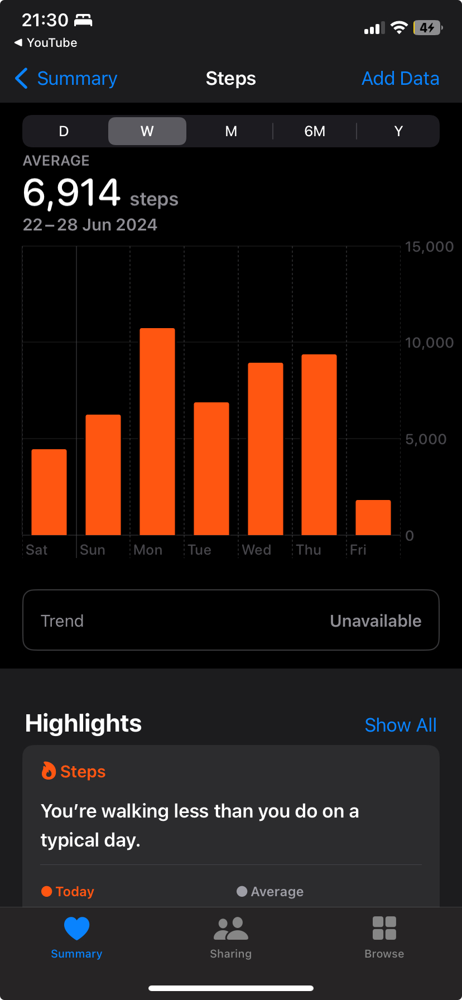
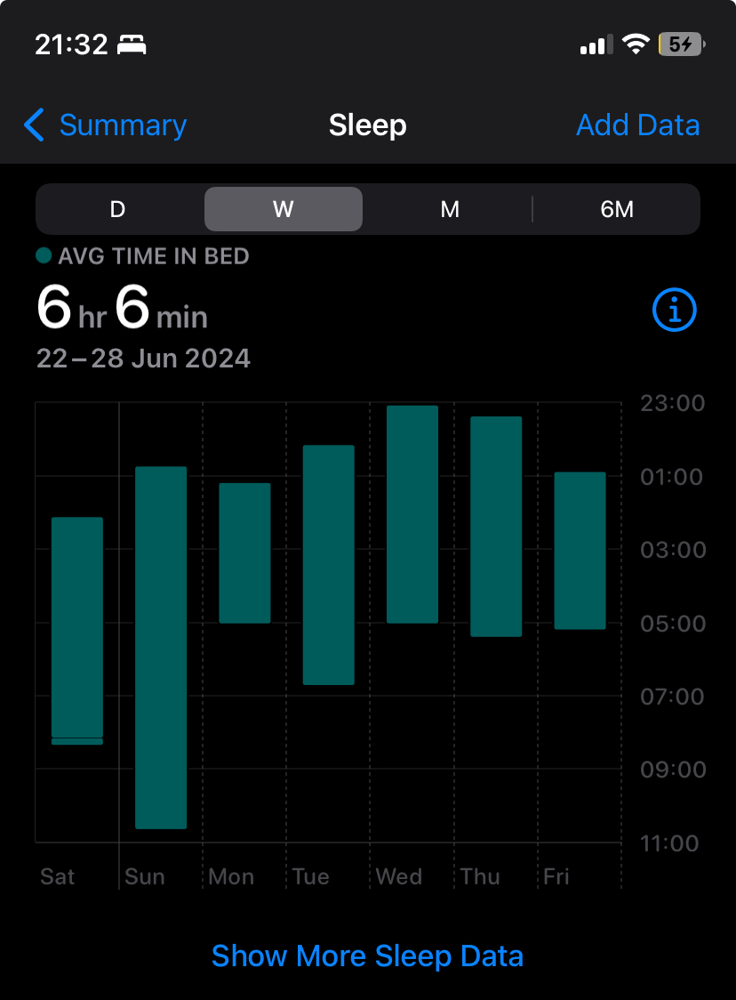

I have been struggling fairly with the blog. I don't write that often. I love writing and reading, but lately, I have not been to do either.

Coming to the topic. The week started with me waking up at 5am every day. My kiddo started Grade-1 and we need to wake up, and get him ready for school and drop him to school. After that, my wife and  I go for a walk. We are doing this pretty regularly for some weeks and it feels good.

The only thing that's bad in this is what we go to sleep fairly late (Never before 12.30am), and wake up early, so we both are sleep deprived. Now to compensate the sleep loss, we tend to get a quick nap after our walk. This is not good, but we are trying to get to bed early. In a perfect world, I would always like to have a 8hr sleep, but that's not possible with the current schedule.




Life at work has been moderately stressful as well. I am working on a newer stack and there is insane amount of code and business rules to understand. I think I am handling it fairly well, but it's always humbling working on something new and realizing how much you don't know. It's also a project with DDD (Domain Driven Development) and I am trying to understand the concepts and apply them. It's a good learning experience. Great thing about the project is an insane amount of test coverage and that gives me a lot of confidence in making changes. Also, my local setup has issues, so only way I can make sure my code works is by running the tests and writing them.  I have done most amount of TDD in my life in the last 1 year and I get the appeal, especially when you are working on a complex system and with many other people.

I also got a couple of new books last week and I will try to read them this weekend and make some notes. I have so many great books at home and if I am able to make strides with them, I will definitely be able to achieve much more in life.

I also have been thinking about my blog and how I can make it better. I have been thinking about writing more and more and I think I will be able to do it. I have been thinking about writing about my work, and even small things that I learnt daily. The blog is just for me and me alone.

That's it folks. Hoping to write more content like this in future. Til then, have a good weekend.


```

o   ^__^
 o  (oo)\_______
    (__)\       )\/\
        ||----w |
        ||     ||
```
