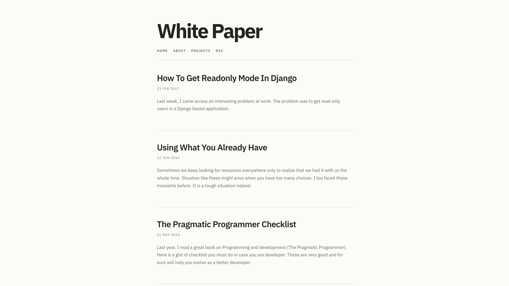
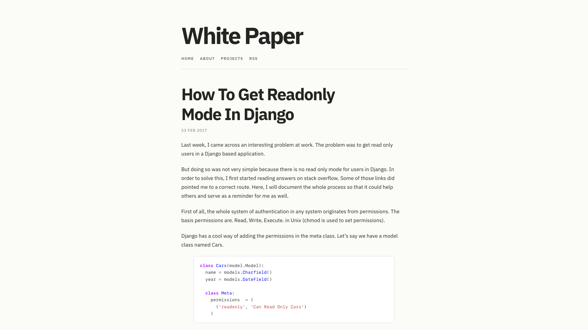
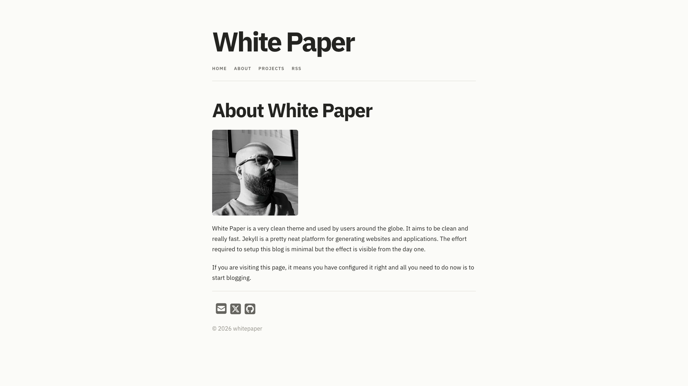

I made **White Paper** many years ago because I wanted a Jekyll theme that stayed out of the way. No busy sidebar, no heavy decoration—just a title, a few links, and the writing.

This week I gave it a proper update without changing that idea.

The theme now runs on Ruby 4.0 and Jekyll 4.4. I replaced the old Grunt setup with Vite and Sass, refreshed the dependencies, added automated builds, and kept right-to-left stylesheet support.

Most of the visible work is deliberately subtle. The type is easier to read, spacing is more consistent, code blocks and tables feel cleaner, and the layout works better on smaller screens. I also tightened the gap below the header after seeing the first version live. Sometimes a screenshot tells you more than staring at CSS ever will.

It still looks like White Paper, which was the point. The update is not a reinvention. It is the same small theme, with a healthier foundation and a little more care around the edges.

You can [see the theme live](https://vinitkumar.github.io/white-paper), find the code on [GitHub](https://github.com/vinitkumar/white-paper), or read the [White Paper 7.0.0 release notes](https://github.com/vinitkumar/white-paper/releases/tag/v7.0.0).
